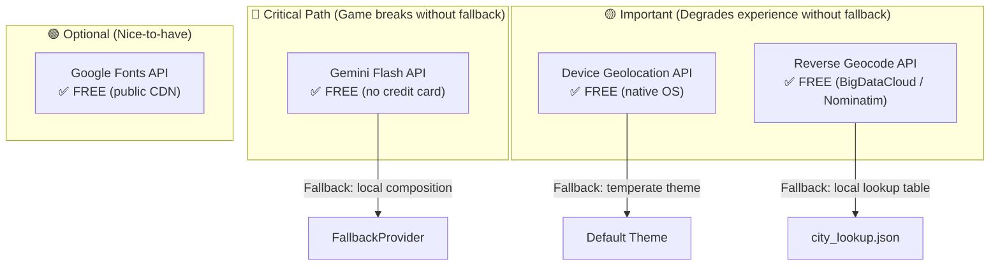
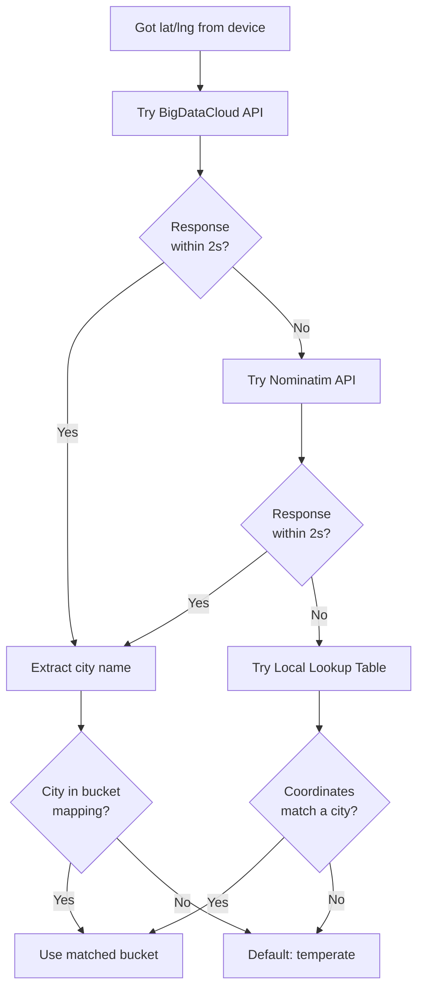
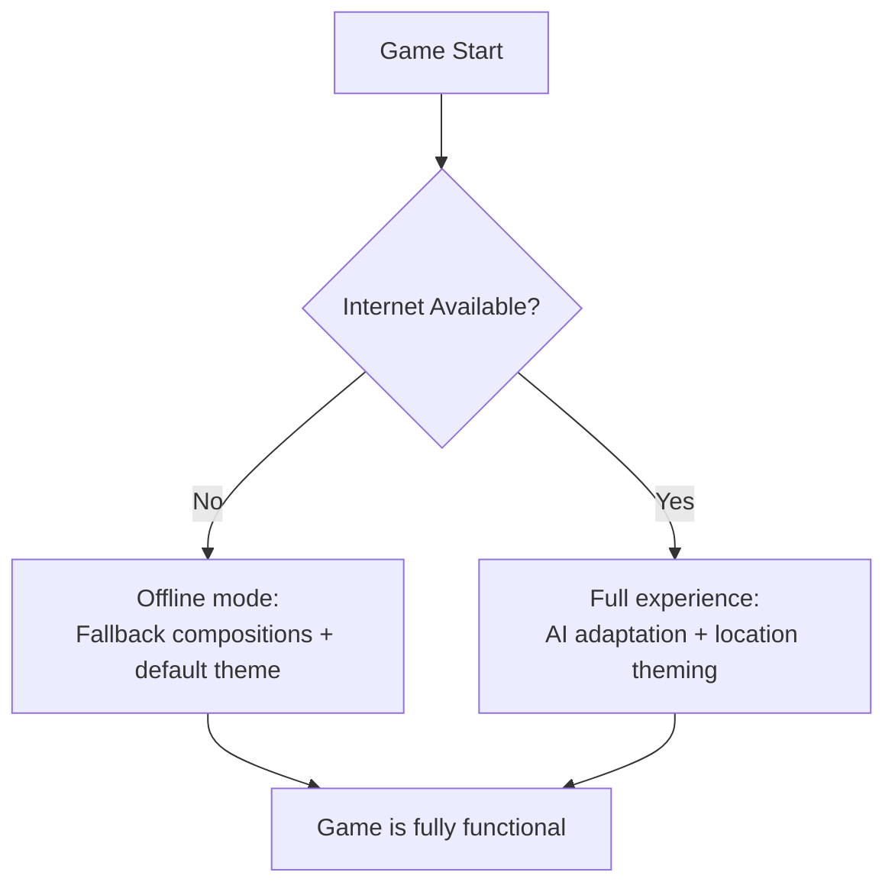

# 🔌 APIS — External APIs & Services Reference

> **API Reference Document** | v1.1 | September 2026
> Every external API and service Patient Zero: Protocol depends on — **all 100% free, no credit card required**.

---

## 💰 Cost Summary — Everything Is Free

> [!TIP]
> **Total cost to build and demo Patient Zero: $0.00**
> Every API, service, asset source, and tool listed in this document is completely free with no credit card or billing setup required.

| Resource | Cost | Notes |
|---|---|---|
| Gemini Flash API | **Free** | Free tier: 15 RPM, 1,500 RPD — more than enough |
| Device Geolocation | **Free** | Native OS API, no external service |
| Reverse Geocode (BigDataCloud) | **Free** | No API key needed for basic tier |
| Reverse Geocode (Nominatim/OSM) | **Free** | No API key needed, 1 req/sec limit |
| Local Lookup Table | **Free** | Bundled JSON, no network needed |
| Google Fonts (web download) | **Free** | Public CDN, no auth |
| Unity Engine | **Free** | Personal license (revenue < $100K) |
| Sound Effects (Freesound.org) | **Free** | CC0 / Public Domain |
| Sound Effects (Kenney.nl) | **Free** | CC0 assets |
| 3D Assets (Kenney.nl) | **Free** | CC0 assets |
| GitHub | **Free** | Free private repos |

---

## 1. API Dependency Map



| API | Cost | Auth Required? | Credit Card? | Has Fallback? | Offline-Safe? |
|---|---|---|---|---|---|
| Gemini Flash API | ✅ Free tier | API Key (free) | ❌ No | ✅ Local fallback | ✅ Fully playable |
| Device Geolocation | ✅ Free | User permission | ❌ No | ✅ Default theme | ✅ Starts normally |
| BigDataCloud Geocode | ✅ Free | None | ❌ No | ✅ Local lookup | ✅ Starts normally |
| Nominatim (OSM) | ✅ Free | None | ❌ No | ✅ Local lookup | ✅ Starts normally |
| Google Fonts | ✅ Free | None | ❌ No | ✅ System font | ✅ Renders fine |

---

## 2. Gemini Flash API

### Overview

| Field | Value |
|---|---|
| **Purpose** | Generate adaptive wave compositions and taunts from player behavior data |
| **Provider** | Google (Generative AI) |
| **Model** | `gemini-2.0-flash` (or latest flash-tier) |
| **Auth** | API Key (free, no credit card) |
| **Call Frequency** | Once per wave-end (~every 30–90 seconds during gameplay) |
| **Latency Target** | < 2 seconds |
| **Cost** | ✅ **Completely free** — free tier is more than sufficient |

### How to Get an API Key (Free)

1. Go to [https://aistudio.google.com/apikey](https://aistudio.google.com/apikey)
2. Sign in with any Google account
3. Click **"Create API Key"**
4. Copy the key
5. **No billing setup, no credit card, no payment required**

### Endpoint

```
POST https://generativelanguage.googleapis.com/v1beta/models/gemini-2.0-flash:generateContent?key={API_KEY}
```

### Request Headers

```
Content-Type: application/json
```

### Request Body

```json
{
  "contents": [
    {
      "role": "user",
      "parts": [
        {
          "text": "{behavior_summary_json_string}"
        }
      ]
    }
  ],
  "systemInstruction": {
    "parts": [
      {
        "text": "{full_system_prompt_from_PROMPTS.md}"
      }
    ]
  },
  "generationConfig": {
    "temperature": 0.7,
    "maxOutputTokens": 200,
    "topP": 0.9,
    "topK": 40,
    "responseMimeType": "application/json",
    "responseSchema": {
      "type": "object",
      "properties": {
        "next_wave_composition": {
          "type": "object",
          "properties": {
            "standard": { "type": "integer" },
            "fast": { "type": "integer" },
            "tanky": { "type": "integer" }
          },
          "required": ["standard", "fast", "tanky"]
        },
        "spawn_zone_bias": {
          "type": "string",
          "enum": ["north_chokepoint", "center_open", "south_pillar", "east_flank", "balanced"]
        },
        "taunt_text": { "type": "string" },
        "enemy_theme_variant": {
          "type": "string",
          "enum": ["drowned", "scorched", "rotted", "frozen", "infected"]
        }
      },
      "required": ["next_wave_composition", "spawn_zone_bias", "taunt_text"]
    }
  }
}
```

### Response Structure

```json
{
  "candidates": [
    {
      "content": {
        "parts": [
          {
            "text": "{\"next_wave_composition\":{\"standard\":5,\"fast\":3,\"tanky\":2},\"spawn_zone_bias\":\"north_chokepoint\",\"taunt_text\":\"Predictable. You favor the northern pillar. Adjusting.\",\"enemy_theme_variant\":null}"
          }
        ],
        "role": "model"
      },
      "finishReason": "STOP"
    }
  ]
}
```

### Parsing Steps

1. Check HTTP status code = `200`
2. Extract `response.candidates[0].content.parts[0].text`
3. Parse the extracted string as JSON
4. Validate against expected schema (see [SAFETY.md](file:///d:/Projects/PATIENT-ZERO/SAFETY.md))
5. Apply safety-rail clamping
6. Forward to Wave/Spawner system and UI

### Free Tier Rate Limits & Quotas

| Limit | Value | Our Usage | Sufficient? |
|---|---|---|---|
| Requests/minute | 15 | ~1 per 30–90 seconds | ✅ Yes (max ~2 RPM) |
| Requests/day | 1,500 | ~50–100 during full dev+demo day | ✅ Yes (using <7%) |
| Tokens/minute | 1,000,000 | ~500 tokens per call | ✅ Yes (using <0.1%) |

> [!NOTE]
> A full 10-wave game session = 10 API calls. Even 100 test sessions in a day = 1,000 calls, still within the free 1,500/day limit.

### Error Codes

| HTTP Status | Meaning | Game Response |
|---|---|---|
| `200` | Success | Parse and use response |
| `400` | Bad request (malformed body) | Log error, use fallback composition |
| `403` | Invalid API key | Log error, use fallback, alert developer |
| `429` | Rate limit exceeded | Use fallback, retry next wave |
| `500` | Server error | Use fallback composition |
| `503` | Service unavailable | Use fallback composition |
| Timeout (>2s) | Network/latency issue | Use fallback composition |

### Fallback Behavior

When any API call fails, the game uses a deterministic local fallback (see [SAFETY.md](file:///d:/Projects/PATIENT-ZERO/SAFETY.md) Section 3.2):
```
standard: wave_number + 1
fast:     max(1, floor(wave_number / 2))
tanky:    max(1, floor(wave_number / 3))
zone:     "balanced"
taunt:    "..."
```

---

## 3. Device Geolocation API

### Overview

| Field | Value |
|---|---|
| **Purpose** | Get player's real-world coordinates at game start (one-time) |
| **Provider** | Device OS (no external service) |
| **Auth** | User permission prompt |
| **Call Frequency** | Once per game start |
| **Latency Target** | < 5 seconds |
| **Cost** | ✅ **Free** (native device API, no network call) |

### Unity Implementation

```csharp
// Request permission and get coordinates
IEnumerator GetDeviceLocation() {
    // Check if location services are enabled
    if (!Input.location.isEnabledByUser) {
        Debug.Log("Location not enabled by user");
        yield return FallbackToDefault();
        yield break;
    }

    Input.location.Start(500f, 500f); // accuracy in meters (coarse is fine)

    int timeout = 5;
    while (Input.location.status == LocationServiceStatus.Initializing && timeout > 0) {
        yield return new WaitForSeconds(1);
        timeout--;
    }

    if (timeout <= 0 || Input.location.status == LocationServiceStatus.Failed) {
        Debug.Log("Location timed out or failed");
        yield return FallbackToDefault();
        yield break;
    }

    float latitude = Input.location.lastData.latitude;
    float longitude = Input.location.lastData.longitude;
    Input.location.Stop();

    // Pass to reverse geocode
    yield return ReverseGeocode(latitude, longitude);
}
```

### Web Implementation

```javascript
function getDeviceLocation(): Promise<{lat: number, lng: number}> {
    return new Promise((resolve, reject) => {
        if (!navigator.geolocation) {
            reject(new Error('Geolocation not supported'));
            return;
        }

        navigator.geolocation.getCurrentPosition(
            (position) => {
                resolve({
                    lat: position.coords.latitude,
                    lng: position.coords.longitude
                });
            },
            (error) => {
                reject(error);
            },
            {
                enableHighAccuracy: false, // coarse is fine
                timeout: 5000,
                maximumAge: 300000 // 5 min cache OK
            }
        );
    });
}
```

### Permission Handling

| Platform | Permission | User Action |
|---|---|---|
| Android | `ACCESS_COARSE_LOCATION` | System dialog prompt |
| iOS | `NSLocationWhenInUseUsageDescription` | System dialog prompt |
| Web | Geolocation API permission | Browser dialog prompt |

> [!IMPORTANT]
> **We only need COARSE location.** Do not request fine/precise location — it triggers stricter permission dialogs and is unnecessary (we only need city-level accuracy).

### Fallback Chain

```
Permission denied → Default "temperate"
Timeout (>5s) → Default "temperate"
API unavailable → Default "temperate"
```

---

## 4. Reverse Geocode API

### Overview

| Field | Value |
|---|---|
| **Purpose** | Convert lat/lng coordinates into a city/region name |
| **Call Frequency** | Once per game start |
| **Latency Target** | < 2 seconds |
| **Cost** | ✅ **Free** — all recommended options are free with no key |

### Recommended Priority Order

| Priority | Service | Cost | API Key? | Credit Card? | Best For |
|---|---|---|---|---|---|
| 🥇 **Primary** | BigDataCloud | ✅ Free | ❌ None needed | ❌ No | Simplest, no auth, reliable |
| 🥈 **Secondary** | Nominatim (OSM) | ✅ Free | ❌ None needed | ❌ No | Widely used, accurate |
| 🥉 **Fallback** | Local Lookup Table | ✅ Free | ❌ N/A | ❌ No | Offline, zero latency |
| ❌ ~~Avoid~~ | ~~Google Maps Geocoding~~ | ~~$5/1K requests~~ | ~~Yes~~ | ~~Yes (billing required)~~ | ~~Requires credit card setup~~ |

> [!WARNING]
> **Do NOT use Google Maps Geocoding API.** It requires Google Cloud billing setup (credit card) even for the free $200/month credit tier. For a hackathon, this is unnecessary friction. Use BigDataCloud or Nominatim instead — both are truly free with zero setup.

---

### Option A: BigDataCloud (Recommended — Primary)

**Why this is the best option:**
- ✅ Completely free for basic reverse geocoding
- ✅ No API key required for client-side calls
- ✅ No account creation needed
- ✅ No rate limit for reasonable usage
- ✅ Returns city name directly
- ✅ Fast response (~200ms)

**Endpoint (no key needed):**
```
GET https://api.bigdatacloud.net/data/reverse-geocode-client?latitude={lat}&longitude={lng}&localityLanguage=en
```

**Response:**
```json
{
  "city": "Mumbai",
  "locality": "Mumbai",
  "principalSubdivision": "Maharashtra",
  "countryName": "India",
  "countryCode": "IN",
  "continent": "Asia",
  "localityInfo": {
    "administrative": [
      {
        "name": "Mumbai",
        "description": "populated place",
        "order": 8
      }
    ]
  }
}
```

**Parsing:**
1. Extract `response.city` or `response.locality`
2. If both empty, try `response.localityInfo.administrative[0].name`
3. Look up city in theme bucket mapping
4. If no match → use `"temperate"` default

**Unity Implementation:**
```csharp
IEnumerator ReverseGeocode(float lat, float lng) {
    string url = $"https://api.bigdatacloud.net/data/reverse-geocode-client?latitude={lat}&longitude={lng}&localityLanguage=en";
    
    using (UnityWebRequest req = UnityWebRequest.Get(url)) {
        req.timeout = 2; // 2 second timeout
        yield return req.SendWebRequest();
        
        if (req.result == UnityWebRequest.Result.Success) {
            var json = JsonUtility.FromJson<BigDataCloudResponse>(req.downloadHandler.text);
            string city = !string.IsNullOrEmpty(json.city) ? json.city : json.locality;
            themeBucket = LookupThemeBucket(city);
        } else {
            // Try local lookup table, then default
            themeBucket = LocalLookup(lat, lng);
        }
    }
}
```

**Web Implementation:**
```javascript
async function reverseGeocode(lat: number, lng: number): Promise<string> {
    try {
        const response = await fetch(
            `https://api.bigdatacloud.net/data/reverse-geocode-client?latitude=${lat}&longitude=${lng}&localityLanguage=en`,
            { signal: AbortSignal.timeout(2000) }
        );
        const data = await response.json();
        const city = data.city || data.locality || '';
        return lookupThemeBucket(city);
    } catch (error) {
        return localLookup(lat, lng);
    }
}
```

---

### Option B: Nominatim / OpenStreetMap (Secondary)

**Why use this as a secondary:**
- ✅ Completely free, no API key
- ✅ Open source data (OpenStreetMap)
- ⚠️ Strict 1 request/second rate limit (fine for us — we only call once)
- ⚠️ Requires custom `User-Agent` header

**Endpoint:**
```
GET https://nominatim.openstreetmap.org/reverse?format=json&lat={lat}&lon={lng}&zoom=10
```

**Required Headers:**
```
User-Agent: PatientZero-Game/1.0 (hackathon project; contact@example.com)
```

**Response:**
```json
{
  "address": {
    "city": "Mumbai",
    "state": "Maharashtra",
    "country": "India",
    "country_code": "in"
  }
}
```

**Parsing:**
1. Extract `response.address.city`
2. If empty, try `response.address.town` or `response.address.village`
3. Look up city in theme bucket mapping

> [!NOTE]
> Nominatim's usage policy requires a valid `User-Agent` header identifying your app. Requests without one may be blocked. Our single-call-per-game usage is well within acceptable limits.

---

### Option C: Local Lookup Table (Offline Fallback)

If both BigDataCloud and Nominatim fail (no network), fall back to a local coordinate-range lookup:

```json
{
  "cities": [
    { "name": "Mumbai",     "lat_range": [18.8, 19.3], "lng_range": [72.7, 73.0], "bucket": "coastal" },
    { "name": "Delhi",      "lat_range": [28.4, 28.9], "lng_range": [76.9, 77.4], "bucket": "desert" },
    { "name": "Bangalore",  "lat_range": [12.8, 13.1], "lng_range": [77.4, 77.8], "bucket": "temperate" },
    { "name": "Chennai",    "lat_range": [12.9, 13.2], "lng_range": [80.1, 80.4], "bucket": "coastal" },
    { "name": "Jaipur",     "lat_range": [26.7, 27.1], "lng_range": [75.6, 76.0], "bucket": "desert" },
    { "name": "Shimla",     "lat_range": [31.0, 31.2], "lng_range": [77.1, 77.3], "bucket": "mountain" },
    { "name": "Goa",        "lat_range": [15.2, 15.6], "lng_range": [73.7, 74.1], "bucket": "coastal" },
    { "name": "Hyderabad",  "lat_range": [17.2, 17.6], "lng_range": [78.3, 78.6], "bucket": "urban" },
    { "name": "Kolkata",    "lat_range": [22.4, 22.7], "lng_range": [88.2, 88.5], "bucket": "coastal" },
    { "name": "Pune",       "lat_range": [18.4, 18.7], "lng_range": [73.7, 74.0], "bucket": "temperate" },
    { "name": "Lucknow",    "lat_range": [26.7, 27.0], "lng_range": [80.8, 81.1], "bucket": "temperate" },
    { "name": "Ahmedabad",  "lat_range": [22.9, 23.2], "lng_range": [72.4, 72.7], "bucket": "desert" },
    { "name": "Chandigarh", "lat_range": [30.6, 30.8], "lng_range": [76.7, 76.9], "bucket": "temperate" },
    { "name": "Kochi",      "lat_range": [9.9, 10.1],  "lng_range": [76.2, 76.4], "bucket": "coastal" },
    { "name": "Indore",     "lat_range": [22.6, 22.8], "lng_range": [75.8, 76.0], "bucket": "temperate" }
  ],
  "default_bucket": "temperate"
}
```

**Lookup Logic:**
1. For each city, check if player's lat/lng falls within `lat_range` AND `lng_range`
2. If match found → return that city's `bucket`
3. If no match → return `default_bucket` ("temperate")

### Reverse Geocode Fallback Chain



---

## 5. Google Fonts (Optional — Free)

### Overview

| Field | Value |
|---|---|
| **Purpose** | Load terminal-style monospace font for taunt display |
| **Provider** | Google Fonts |
| **Auth** | None (public CDN) |
| **Call Frequency** | Once at page load (web only) |
| **Cost** | ✅ **Free** (public CDN, no auth, no key) |

### Web Implementation

```html
<link rel="preconnect" href="https://fonts.googleapis.com">
<link rel="preconnect" href="https://fonts.gstatic.com" crossorigin>
<link href="https://fonts.googleapis.com/css2?family=JetBrains+Mono:wght@400;700&display=swap" rel="stylesheet">
```

### Unity Implementation

- Download `JetBrainsMono-Regular.ttf` from [Google Fonts](https://fonts.google.com/specimen/JetBrains+Mono) (free download)
- Import into `Assets/UI/Fonts/`
- No runtime API call needed

### Fallback

If font fails to load: use system monospace (`monospace`, `Courier New`, or Unity's built-in monospace)

---

## 6. Free Asset Sources

All assets used in Patient Zero should be **free and properly licensed (CC0 / Public Domain / OFL)**:

### Sound Effects

| Source | URL | License | What to Get |
|---|---|---|---|
| **Freesound.org** | [freesound.org](https://freesound.org) | CC0 / CC-BY (check per sound) | Gunshots, impacts, explosions, ambient |
| **Kenney.nl** | [kenney.nl/assets](https://kenney.nl/assets) | CC0 (all assets) | Game SFX packs, UI sounds |
| **OpenGameArt.org** | [opengameart.org](https://opengameart.org) | CC0 / CC-BY (check per asset) | Music loops, ambient sounds |
| **Pixabay** | [pixabay.com/sound-effects](https://pixabay.com/sound-effects/) | Pixabay License (free) | General sound effects |

### Fonts

| Font | URL | License | Use For |
|---|---|---|---|
| **JetBrains Mono** | [Google Fonts](https://fonts.google.com/specimen/JetBrains+Mono) | OFL (free) | Taunt text, terminal style |
| **Inter** | [Google Fonts](https://fonts.google.com/specimen/Inter) | OFL (free) | HUD text, UI |
| **Source Code Pro** | [Google Fonts](https://fonts.google.com/specimen/Source+Code+Pro) | OFL (free) | Alternative terminal font |
| **Outfit** | [Google Fonts](https://fonts.google.com/specimen/Outfit) | OFL (free) | Alternative HUD font |

### 3D Assets (if needed)

| Source | URL | License | What to Get |
|---|---|---|---|
| **Kenney.nl** | [kenney.nl/assets](https://kenney.nl/assets) | CC0 (all assets) | Low-poly characters, environment packs |
| **Quaternius** | [quaternius.com](https://quaternius.com) | CC0 | Animated low-poly characters (zombies!) |
| **Poly Pizza** | [poly.pizza](https://poly.pizza) | CC-BY | 3D models (filter by license) |
| **Sketchfab** | [sketchfab.com](https://sketchfab.com) | CC0 / CC-BY (filter) | Free downloadable 3D models |

### UI / Icons

| Source | URL | License | What to Get |
|---|---|---|---|
| **Heroicons** | [heroicons.com](https://heroicons.com) | MIT (free) | SVG icons for HUD |
| **Lucide** | [lucide.dev](https://lucide.dev) | ISC (free) | Icon library |
| **Game-icons.net** | [game-icons.net](https://game-icons.net) | CC-BY 3.0 | Game-themed icons |

---

## 7. API Keys Summary

| API | Key Name | Where to Get | Cost | Credit Card? |
|---|---|---|---|---|
| Gemini Flash | `GEMINI_API_KEY` | [Google AI Studio](https://aistudio.google.com/apikey) | ✅ Free | ❌ No |
| BigDataCloud | None needed | N/A | ✅ Free | ❌ No |
| Nominatim (OSM) | None needed | N/A | ✅ Free | ❌ No |
| Google Fonts | None needed | N/A | ✅ Free | ❌ No |

> [!CAUTION]
> **Never commit API keys to Git.** Even though Gemini's free tier doesn't cost money, leaked keys can be abused. Add config files containing keys to `.gitignore`.

### `.gitignore` Entries

```gitignore
# API keys and config
Assets/Config/ai_config.json
Assets/Config/api_keys.json
*.env
.env.local
```

---

## 8. API Call Budget (Per Game Session)

| API | Calls per Session | Avg Latency | Cost |
|---|---|---|---|
| Gemini Flash (free tier) | 5–15 (one per wave) | ~1 second | ✅ $0.00 |
| Device Geolocation | 1 (game start) | ~1–3 seconds | ✅ $0.00 |
| BigDataCloud Reverse Geocode | 1 (game start) | ~200ms | ✅ $0.00 |
| Google Fonts | 1 (page load, web only) | ~100ms | ✅ $0.00 |
| **Total** | **8–18 calls** | — | **✅ $0.00** |

---

## 9. Network Dependency Matrix



| Feature | Requires Network? | Offline Behavior |
|---|---|---|
| Core gameplay (move, shoot, kill) | ❌ No | Works perfectly |
| Wave spawning | ❌ No | Uses fallback compositions |
| AI adaptation | ✅ Yes (Gemini API) | Falls back to deterministic scaling |
| AI taunts | ✅ Yes (Gemini API) | Displays `"..."` (silence) |
| Location theming | ✅ Yes (Geolocation + Geocode) | Defaults to `temperate` |
| Arena rendering | ❌ No | Works with any theme |
| HUD / UI | ❌ No | Works perfectly |
| Score / Game Over | ❌ No | Works perfectly |

---

## 10. Alternatives Considered & Rejected

| Service | Why Rejected |
|---|---|
| **Google Maps Geocoding API** | Requires Google Cloud billing setup (credit card) even for free tier. Unnecessary for a hackathon. |
| **OpenAI API** | No free tier without credit card. Gemini Flash free tier is superior for our use case. |
| **Mapbox Geocoding** | Free tier requires account + API key creation with email verification. BigDataCloud is simpler. |
| **HERE Geocoding** | Free tier requires account creation. Overkill for a single reverse geocode call. |
| **Paid asset stores** | Unity Asset Store paid packs, Turbosquid, etc. — CC0 sources are sufficient for a hackathon. |

---

*Every API and resource in this document is 100% free with no credit card required. Total build cost: $0.00.*
