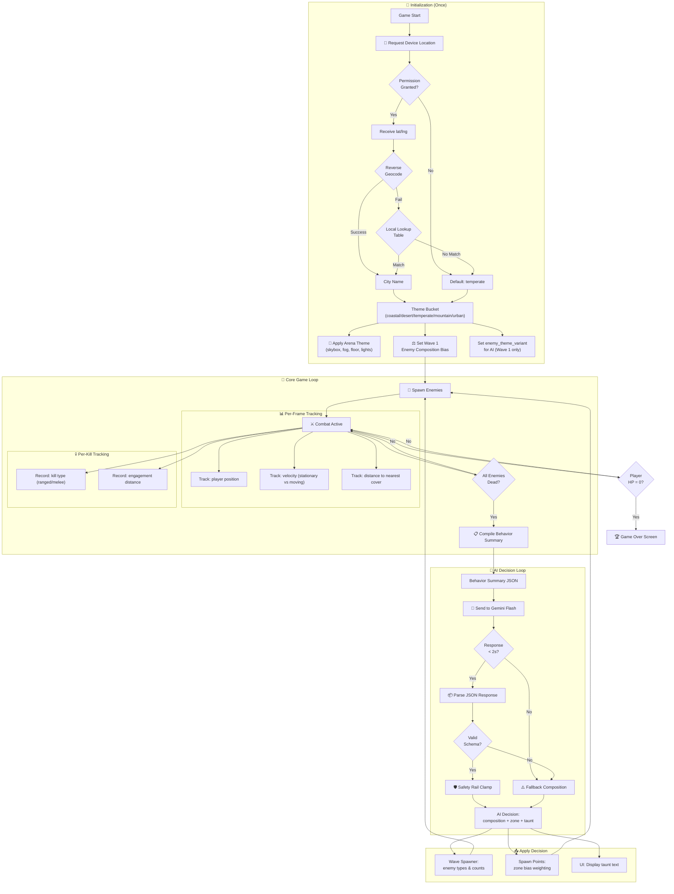
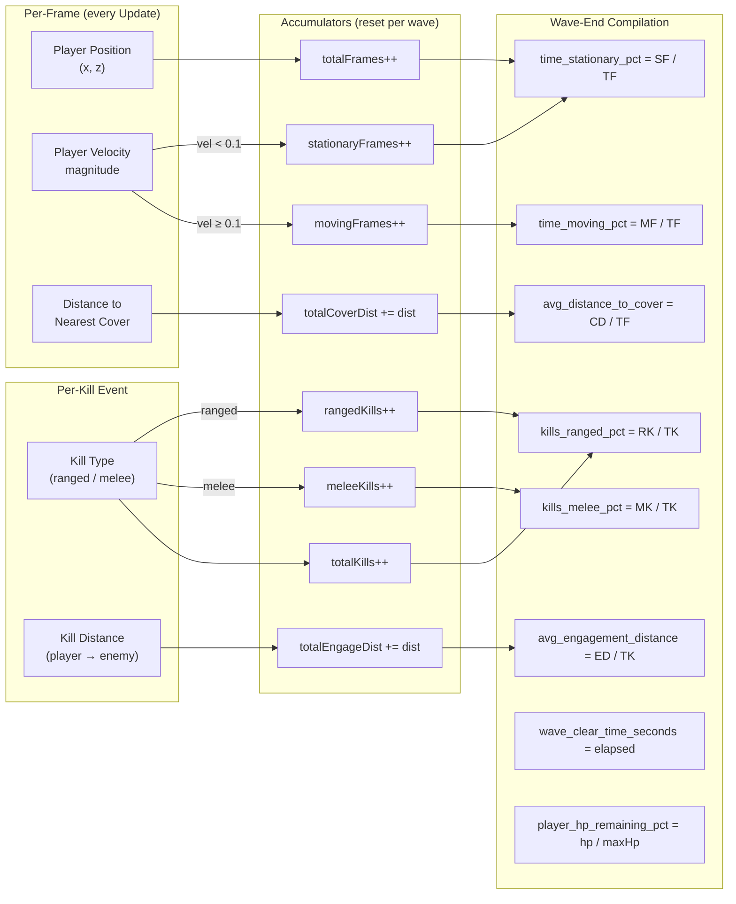
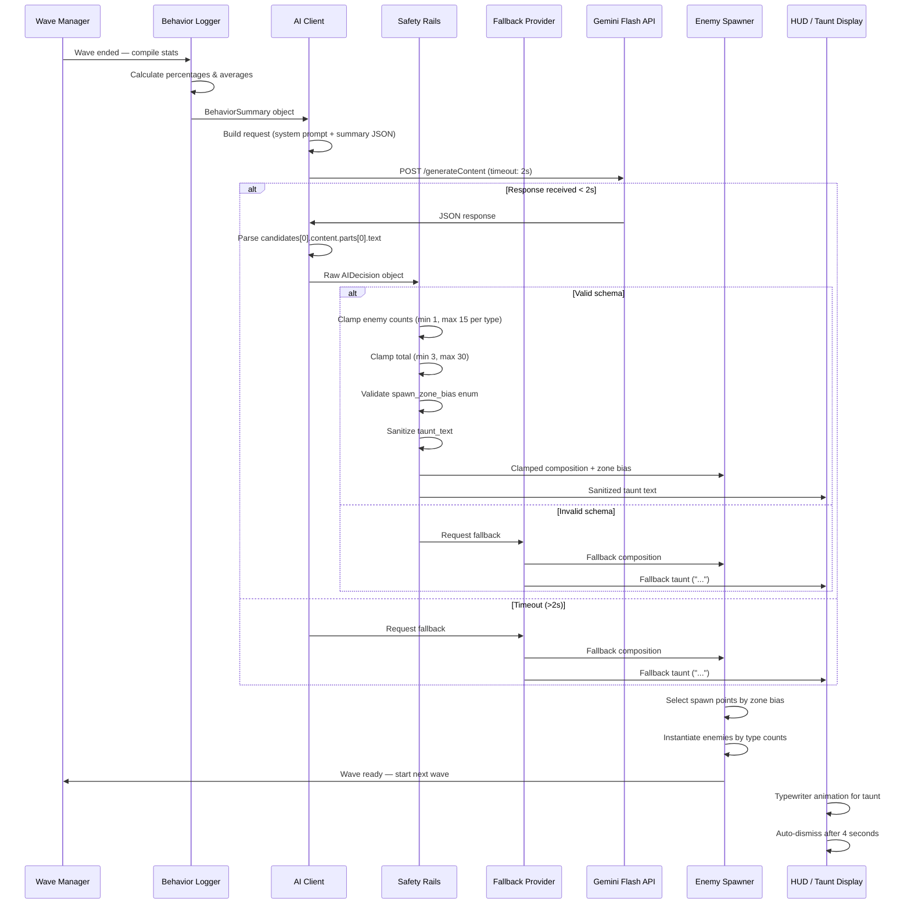
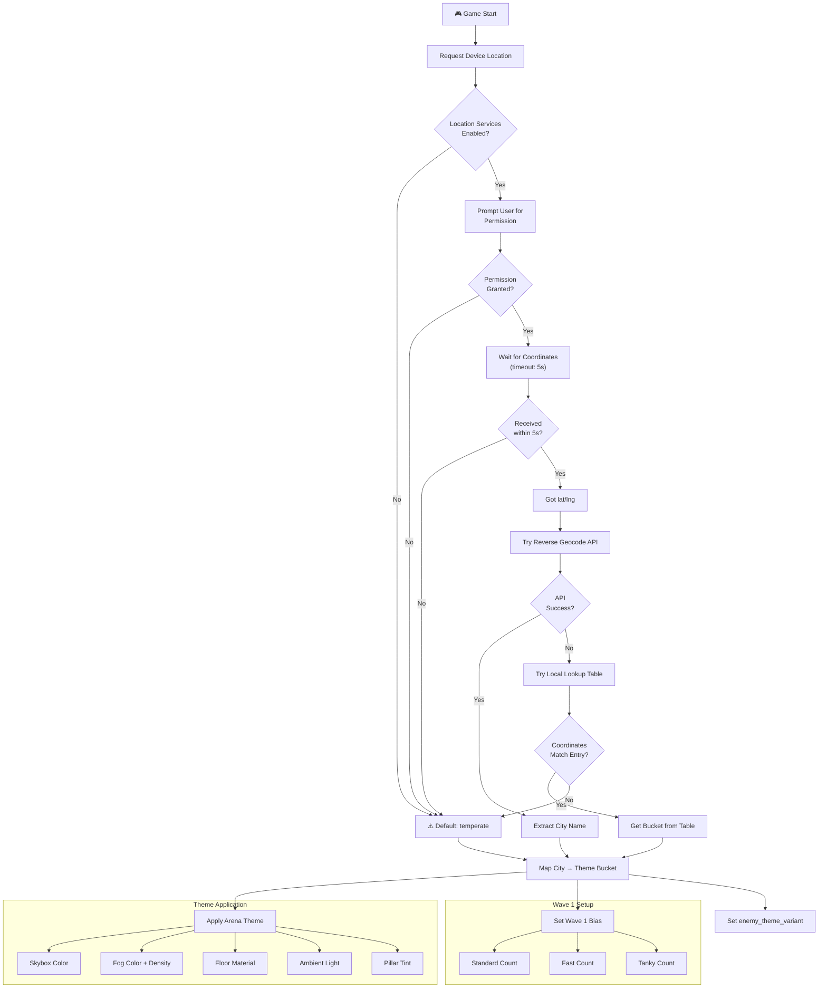
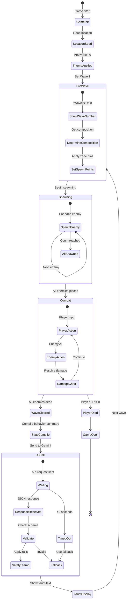
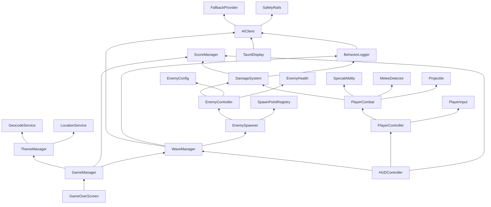

# 📊 DATAFLOW — System Data Flow & Architecture Diagrams

> **Data Flow Document** | v1.0 | September 2026
> Visual architecture reference — how data moves through Patient Zero: Protocol.

---

## 1. Master Data Flow

The complete data journey from game start to game over:



---

## 2. Behavior Logger Data Flow

How player metrics are collected, accumulated, and compiled:



---

## 3. AI Client Module — Internal Flow



---

## 4. Location Seeding Flow



---

## 5. Wave Lifecycle State Machine



---

## 6. Component Dependency Graph

Which systems depend on which:



---

## 7. Event System

Key game events and which systems listen to them:

| Event | Fired By | Listeners | Data |
|---|---|---|---|
| `OnEnemyKilled` | DamageSystem | BehaviorLogger, ScoreManager, WaveManager | `{enemyType, killType, distance, position}` |
| `OnPlayerDamaged` | DamageSystem | HUDController, PlayerController | `{damageAmount, remainingHP}` |
| `OnPlayerDeath` | PlayerController | GameManager, GameOverScreen | `{finalScore, waveReached}` |
| `OnWaveStart` | WaveManager | BehaviorLogger, HUDController | `{waveNumber, composition}` |
| `OnWaveEnd` | WaveManager | BehaviorLogger, AIClient | `{waveNumber}` |
| `OnAIResponseReceived` | AIClient | WaveManager, TauntDisplay | `{AIDecision}` |
| `OnThemeResolved` | ThemeManager | Arena (visual setup) | `{themeBucket}` |
| `OnScoreChanged` | ScoreManager | HUDController | `{newScore, delta}` |

---

## 8. Network Request Timeline

Typical game session showing all network calls:

```
Time (s)  Event                           Network Call
──────────────────────────────────────────────────────────
0.0       Game Start                      ─
0.1       Request Location                📍 Device GPS (local)
0.5       Location Received               ─
0.6       Reverse Geocode                 🌐 BigDataCloud (free, ~200ms)
0.8       Theme Applied                   ─
1.0       Wave 1 Starts                   ─
          ... combat (30-60s) ...
35.0      Wave 1 Ends                     ─
35.1      Behavior Summary Compiled       ─
35.2      AI Call                          🧠 Gemini Flash (~1s)
36.2      AI Response Received            ─
36.3      Taunt Displayed                 ─
39.0      Wave 2 Starts                   ─
          ... combat (30-60s) ...
75.0      Wave 2 Ends                     ─
75.2      AI Call                          🧠 Gemini Flash (~1s)
          ... repeat ...
          
Total API calls for a 10-wave session:
  📍 GPS: 1 (local)
  🌐 Geocode: 1
  🧠 Gemini: 10
  Total: 12 network requests
```

---

*This document visualizes every data pathway in Patient Zero. Use these diagrams as architecture reference during development and debugging.*
