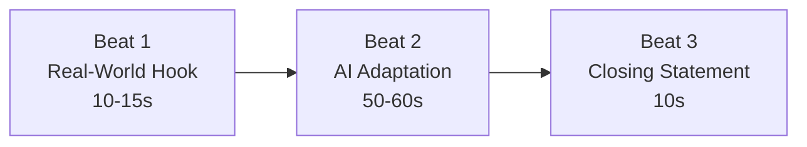

# 🎤 DEMO — Presentation & Demo Guide

> **Demo Script & Presentation Guide** | v1.0 | September 2026
> How to present Patient Zero: Protocol in a 90-second live demo for KICKR Codemania 2026.

---

## 1. Demo Structure Overview

**Total time:** ~90 seconds
**Format:** Live gameplay on a real mobile device (projected to screen)
**Backup:** Pre-recorded video of a successful demo run

---

## 2. Beat 1 — Real-World Hook (10–15 seconds)

### Goal
Show the location-seeding effect immediately. The audience should understand within 10 seconds that this game reads your location and adapts.

### Option A: Two Devices (Preferred)

**Setup:** Two phones side-by-side, one set to a coastal city, one to a desert city.

**Script:**
> "Patient Zero reads your real-world location the moment you start. Watch — this device is set to Mumbai and gets a coastal, drowned-theme arena [gesture to device 1]. This device is set to Jaipur and gets a desert, scorched-theme arena [gesture to device 2]. Different location, different starting conditions, different enemies."

**What judges see:** Two visibly different arena themes running simultaneously.

### Option B: Single Device (Fallback)

**Setup:** One phone showing the game start with visible theme.

**Script:**
> "Patient Zero reads your real-world location at game start. I'm here in [city], so my arena is [theme] — coastal cities get drowned zombies, desert cities get scorched. But the location seed is just the opening. The real AI kicks in after Wave 1."

**What judges see:** One themed arena with a brief explanation.

### Key Visual Elements to Highlight
- Arena color palette clearly different from default
- Enemy visual theme variant visible (drowned/scorched/etc.)
- Quick, confident delivery — don't linger here, this is the appetizer

---

## 3. Beat 2 — AI Adaptation (50–60 seconds)

### Goal
Demonstrate that the AI **observes and counters the player's specific playstyle**. This is the core thesis of the project.

### Planned Playstyle: Camp + Ranged Only

**Pre-play setup:** Before the demo, decide on one clear, exaggerated playstyle to demonstrate. Recommended: **camp the north chokepoint and use only ranged attacks.**

### Step-by-Step

#### Step 1: Play Wave 1 Normally (15 seconds)

**Script:**
> "Wave 1 is seeded by location. Now I'm going to deliberately camp this corner and only use my ranged weapon. Watch what the AI does."

**Actions:**
- Move to the north chokepoint
- Stay still (high `time_stationary_pct`)
- Kill all enemies with ranged fire only (high `kills_ranged_pct`)
- DO NOT move, DO NOT melee, DO NOT use special

#### Step 2: Show the Taunt (10 seconds)

**Script:**
> "Wave cleared. Now the AI analyzes how I just played — it saw me camp this corner and only shoot from range. Here comes its response..."

**What judges see:**
- Wave cleared text
- Brief pause
- Taunt text appears: something like *"Predictable. You favor the northern pillar. Adjusting."*

**Script (reading taunt):**
> "See that? 'Predictable. You favor the northern pillar. Adjusting.' That's Patient Zero — it's not a chatbot, it's not random. It analyzed my specific behavior and made a specific decision."

#### Step 3: Show the Counter-Wave (20 seconds)

**Script:**
> "Now watch Wave 2. The AI is going to punish my camping and my ranged-only playstyle."

**What judges see:**
- More enemies spawning from the north chokepoint (right at the camping spot)
- Tanky enemies appearing (melee-only, can't be efficiently killed at range)
- Fast enemies flanking from behind

**Script (while playing):**
> "See — tanky zombies I can't easily kill at range, fast ones coming from behind my camping spot. The AI didn't just scale difficulty up. It specifically countered HOW I was playing."

#### Step 4: (Optional) Show Adaptation Reset (15 seconds)

If time allows, show one more wave where you change playstyle:

**Script:**
> "Now I'll change my strategy — I'll keep moving and engage at close range."

**What judges see:**
- Player moves around the arena
- Uses melee and special ability
- Next taunt: something like *"Behavioral shift detected. Recalculating."*

---

## 4. Beat 3 — Closing Statement (10 seconds)

### Script

> "Patient Zero never operates as a chatbot or dialogue system. It only ever acts through gameplay consequences — spawns, positioning, taunts. It IS the game's entire difficulty system, its narrative voice, and the reason every playthrough differs. The AI doesn't assist the game. The AI IS the game."

### Delivery Notes
- Make eye contact with judges on the final line
- Confident, declarative tone — this is a thesis statement, not a request
- Do not rush — let the last sentence land

---

## 5. Judge Q&A Preparation

### Anticipated Questions & Answers

#### "How is this different from traditional difficulty scaling?"

> "Traditional difficulty just increases numbers — more enemies, more HP. Patient Zero analyzes *how* you play and changes *what* it sends. Camp a corner? It sends flankers to your corner. Play ranged only? It sends melee-forcing enemies. It's not harder — it's specifically harder for YOUR playstyle."

#### "What if the AI call fails?"

> "We have a 2-second hard timeout with local fallback compositions. The game never shows a loading state — if the AI is slow, the next wave spawns from a deterministic fallback and the player never notices. We designed for demo reliability first."

#### "Why not a chatbot / dialogue system?"

> "Because that would make the AI a feature. We wanted the AI to be the system. Patient Zero never takes text input and never generates conversation. It only expresses itself through gameplay consequences — enemy composition, spawn positioning, and short clinical observations. Remove the AI and the game has no difficulty curve at all."

#### "How does the location thing work?"

> "One-time device geolocation at game start, reverse-geocoded to a city, mapped to one of five climate buckets. Each bucket sets the arena's visual theme and biases Wave 1's enemy mix. If location permission is denied, it defaults to a standard temperate theme — the game never blocks on external data."

#### "What model are you using? Isn't it expensive?"

> "Gemini Flash — it's optimized for speed and cost. We call it once per wave, not per frame or per action. A typical game session of 5–10 waves costs fractions of a cent. The architecture is deliberately designed for minimal API usage."

#### "Can the player outsmart the AI?"

> "That's the fun — it's an arms race. The AI counters your patterns, but if you vary your playstyle enough, you force it to spread its resources. The best players are the ones who are deliberately unpredictable. That's the game's skill ceiling."

#### "What real-world problem does this solve?"

> "Adaptive adversarial AI is how fraud bots, anti-cheat evasion, phishing systems, and market manipulation algorithms work — they study their target's patterns and adjust tactics. Patient Zero makes that abstract threat concrete. You're playing against the same class of system, and you can feel what it's like to be specifically targeted."

---

## 6. Demo Technical Setup

### Checklist (1 Hour Before Demo)

- [ ] Device charged to 100%
- [ ] Game installed and tested on demo device
- [ ] API key verified (make a test AI call)
- [ ] Demo network tested (make sure API calls go through)
- [ ] Screen mirroring / projection tested
- [ ] Backup video loaded and accessible
- [ ] Charger nearby
- [ ] Device in Do Not Disturb mode (no notifications during demo)

### Projection Setup

| Method | Priority | Notes |
|---|---|---|
| USB screen mirroring (scrcpy for Android) | Preferred | Low latency, reliable |
| Wireless mirroring (Miracast/AirPlay) | Fallback | May have lag |
| HDMI adapter | Alternative | Requires adapter cable |
| Pre-recorded video | Emergency | Only if live demo fails |

### Backup Video Specifications

- Record a successful demo run covering all 3 beats
- Include visible taunt text and wave counter
- 720p or higher resolution
- 60 seconds minimum
- Hosted locally on laptop (not dependent on internet)

---

## 7. Slide Deck (Optional Support)

If slides are allowed alongside live demo, keep them minimal:

| Slide | Content | Duration |
|---|---|---|
| 1 — Title | "Patient Zero: Protocol" + one-line pitch | Show before demo |
| 2 — Architecture | Single data flow diagram from [TECHSTACK.md](file:///d:/Projects/PATIENT-ZERO/TECHSTACK.md) | Show during Q&A if asked |
| 3 — Real-World Impact | The adversarial AI framing quote | Show during closing or Q&A |

> [!TIP]
> The live demo IS the presentation. Slides should support, not replace, the gameplay demonstration.

---

## 8. Common Demo Pitfalls to Avoid

| Pitfall | Prevention |
|---|---|
| Talking too much before showing gameplay | Start the game within 15 seconds |
| Playing too many waves (demo runs long) | Cap at 2–3 waves for the demo |
| AI doesn't produce a dramatic taunt | Pre-test the camping strategy to ensure a good taunt |
| Network fails during demo | Fallback compositions keep the game running |
| Device runs out of battery | Full charge + charger on standby |
| Audience can't see the screen | Test projection size and distance beforehand |
| Trying to explain the code | Focus on what the player experiences, not how it works internally |
| Playing too well (wave clears too fast) | Deliberately camp to show the AI adaptation clearly |

---

*This document is your demo playbook. Practice the 90-second flow at least 3 times before the actual presentation.*
