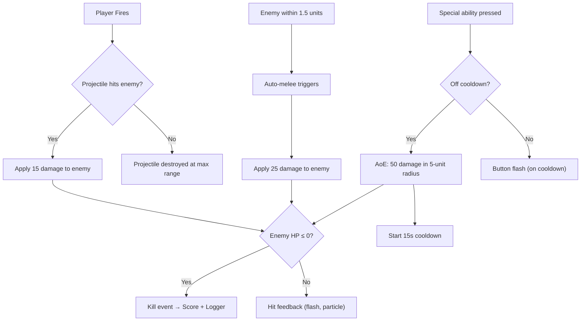
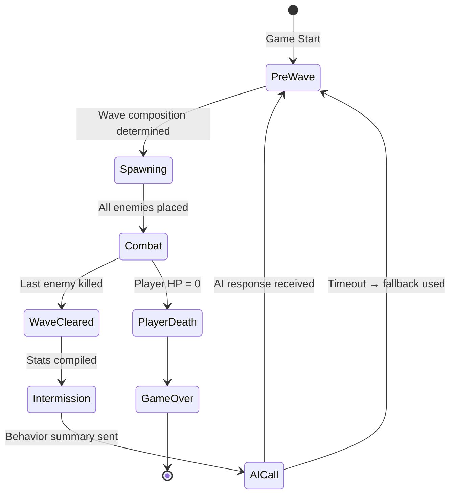

# 🎮 GAMEDESIGN — Game Design Document

> **Game Design Document** | v1.0 | September 2026
> Detailed combat, enemy, arena, and player-experience design for Patient Zero: Protocol.

---

## 1. Arena Design

### Layout

The arena is a single enclosed space designed for wave-based survival. It is deliberately small enough that the player cannot endlessly kite, but large enough that positioning matters.

```
┌──────────────────────────────────────────────────┐
│                                                  │
│    [NW1]  ████ NORTH CHOKEPOINT ████  [NE1]      │
│           ████████████████████████               │
│    [NW2]        ┌──────┐           [NE2]         │
│                 │PILLAR│                         │
│                 │  N   │                         │
│                 └──────┘                         │
│                                                  │
│   [E1]                                           │
│           ┌──────┐         ┌──────┐              │
│  EAST     │PILLAR│  CENTER │PILLAR│    WEST      │
│  FLANK    │  W   │  OPEN   │  E   │    SIDE      │
│           └──────┘         └──────┘              │
│   [E2]                                           │
│                                                  │
│                 ┌──────┐                         │
│                 │PILLAR│                         │
│                 │  S   │                         │
│    [SW1]        └──────┘             [SE1]       │
│           ████████████████████████               │
│           ████ SOUTH PILLAR ZONE ████            │
│                                                  │
│              [PLAYER START]                      │
│                                                  │
└──────────────────────────────────────────────────┘

Legend:
[XX#] = Spawn points
████  = Wall segments / chokepoint barriers
PILLAR = Cover objects (block projectiles + line of sight)
```

### Design Principles

| Principle | Rationale |
|---|---|
| **2–3 chokepoints** | Forces positioning decisions; gives AI spawn_zone_bias meaning |
| **Cover pillars** | Enables camping strategy (which the AI can then counter) |
| **Open center** | High-risk, high-reward area — no cover, but clear sightlines |
| **Enclosed boundaries** | No escape; wave must be fought, not fled from |
| **Named zones** | Each zone has a string identifier for the AI's spawn_zone_bias |

### Zone Properties

| Zone | Character | Risk Level | AI Counter Strategy |
|---|---|---|---|
| `north_chokepoint` | Bottleneck, defensible | Low risk (defensive) | Spawn fast enemies from behind |
| `center_open` | No cover, full visibility | High risk (exposed) | Surround with mixed types |
| `south_pillar` | Cover-heavy, near start | Low risk (safe retreat) | Spawn tanky enemies at close range |
| `east_flank` | Side approach, partial cover | Medium risk | Pressure with fast flankers |

---

## 2. Player Design

### Stats

| Stat | Value | Notes |
|---|---|---|
| **Max HP** | 100 | No regeneration |
| **Move Speed** | 5.0 units/s | Constant, no sprint |
| **Ranged Damage** | 15 per shot | Single projectile per fire |
| **Fire Rate** | 3 shots/second | 0.33s cooldown between shots |
| **Melee Damage** | 25 per hit | Higher than ranged, but risky |
| **Melee Rate** | 1 hit/second | Auto-triggered, slower than ranged |
| **Melee Range** | 1.5 units | Proximity radius for auto-melee |
| **AoE Damage** | 50 in 5-unit radius | Special ability |
| **AoE Cooldown** | 15 seconds | Visible cooldown indicator on button |

### Control Scheme

```
┌─────────────────────────────────────────────────────┐
│                                                     │
│                    GAME VIEW                        │
│                                                     │
│                                                     │
│                                                     │
│   ┌─────────┐                       ┌─────────┐   │
│   │         │                       │  FIRE   │   │
│   │ JOYSTICK│                       │   🔫    │   │
│   │    🕹️   │                       └─────────┘   │
│   │         │                       ┌─────────┐   │
│   └─────────┘                       │ SPECIAL │   │
│                                     │   💥    │   │
│                                     └─────────┘   │
└─────────────────────────────────────────────────────┘
    LEFT THUMB                        RIGHT THUMB
```

**Joystick:**
- Virtual joystick appears on touch-down in left zone
- Normalized direction vector controls player movement
- Player faces movement direction (or aim direction, TBD)
- Deadzone: 0.15 (inner circle)

**Fire Button:**
- Tap or hold to fire
- Hold = continuous fire at fire-rate cap
- Fires in the direction the player is facing
- No ammo limit (infinite ammo, fire-rate is the constraint)

**Special Ability Button:**
- Tap to activate
- Visual cooldown ring around button (fills over 15 seconds)
- Greyed out while on cooldown
- Deals 50 damage to all enemies within 5-unit radius of player

---

## 3. Enemy Design — Detailed

### Enemy Archetypes

All three types share a **single base controller**. Variation is stat-driven and visual (palette + scale), not separate code paths.

#### Standard Zombie

| Property | Value |
|---|---|
| HP | 100 |
| Speed | 3.0 units/s |
| Damage | 10 per hit |
| Attack Range | 1.5 units |
| Attack Cooldown | 1.0s |
| Scale | 1.0x |
| Visual | Grey-green, default proportions |
| Behavior | Walk directly toward player, attack in range |
| Role | Baseline threat, filler unit |

#### Fast Zombie

| Property | Value |
|---|---|
| HP | 50 |
| Speed | 6.0 units/s |
| Damage | 5 per hit |
| Attack Range | 1.5 units |
| Attack Cooldown | 0.5s |
| Scale | 0.8x |
| Visual | Pale/desaturated, hunched, smaller |
| Behavior | Sprint toward player, rapid weak attacks |
| Role | Punish camping, force repositioning |

#### Tanky Zombie

| Property | Value |
|---|---|
| HP | 250 |
| Speed | 1.5 units/s |
| Damage | 20 per hit |
| Attack Range | 2.0 units |
| Attack Cooldown | 1.5s |
| Scale | 1.3x |
| Visual | Dark, bulky, larger |
| Behavior | Slow advance, high damage, soaks ranged fire |
| Role | Force melee engagement, absorb attention |

### Enemy Theme Variants

Based on `location_seed`, enemies receive a visual theme overlay:

| Theme | Visual Change | Ambient FX |
|---|---|---|
| `drowned` (coastal) | Blue-green tint, seaweed particles | Water drip particles |
| `scorched` (desert) | Charred black-orange tint, ember particles | Heat shimmer |
| `rotted` (temperate) | Green-grey, fungal growths | Spore particles |
| `frozen` (mountain) | Frost-blue tint, ice crystal particles | Frost breath |
| `infected` (urban) | Neon-veined, glowing accents | Toxic glow |

> [!NOTE]
> Theme variants are **cosmetic only** — they do not change stats. This keeps game balance independent of location seeding.

---

## 4. Combat System

### Damage Resolution



### Projectile System

| Property | Value |
|---|---|
| Speed | 20 units/s |
| Max Range | 25 units |
| Hitbox | Sphere, radius 0.2 |
| Behavior | Travel in straight line from player, destroy on hit or max range |

### Kill Attribution

Each kill is tagged for the behavior logger:

| Kill Source | Tag | Logger Field |
|---|---|---|
| Projectile hit | `ranged` | Increments `kills_ranged_pct` numerator |
| Auto-melee hit | `melee` | Increments `kills_melee_pct` numerator |
| AoE special | `ranged` | Counted as ranged (AoE is a ranged-class ability) |

---

## 5. Wave Progression

### Wave Lifecycle



### Wave Timing

| Phase | Duration | Notes |
|---|---|---|
| **Pre-Wave** | 2 seconds | "Wave X" text appears, enemies are being spawned |
| **Combat** | Variable | Player fights until all enemies dead |
| **Wave Cleared** | 1 second | "Wave Cleared!" text, stats compiled |
| **Intermission** | 2–3 seconds | AI call in progress, taunt displayed when received |
| **AI Call** | Target < 2s | If >2s, timeout fires and fallback is used |

### Escalation Curve (Expected, not guaranteed — AI decides)

```
Wave  1:  5-6  total enemies (location-seeded composition)
Wave  2:  6-8  total enemies (first AI-driven wave)
Wave  3:  7-9  total enemies
Wave  4:  8-10 total enemies
Wave  5:  9-12 total enemies
Wave  6: 10-13 total enemies
Wave  7: 12-15 total enemies
Wave  8: 13-17 total enemies
Wave  9: 15-19 total enemies
Wave 10: 17-22 total enemies
Wave 10+: 18-25 total enemies (soft cap at 30)
```

> [!IMPORTANT]
> The AI controls the actual composition. These numbers are guidelines encoded in the system prompt. Safety rails enforce hard caps (min 3, max 30) regardless.

---

## 6. Scoring System

| Action | Points | Notes |
|---|---|---|
| Kill Standard enemy | 100 | Base value |
| Kill Fast enemy | 75 | Lower HP = easier kill = lower points |
| Kill Tanky enemy | 200 | High HP = harder kill = higher points |
| Wave completion bonus | 50 × wave_number | Escalating bonus per wave survived |
| Melee kill bonus | +25 | Bonus on top of base kill value |
| No-damage wave bonus | 500 | Cleared entire wave without taking damage |

### Score Display
- Running total in HUD (top-right)
- Final score on Game Over screen
- No leaderboard (out of scope for hackathon)

---

## 7. Visual & Audio Design

### Visual Style

**Art Direction:** Low-poly or stylized — achievable in 24 hours, reads well on mobile screens.

**Color Palette (default — `temperate` theme):**
| Element | Color | Hex |
|---|---|---|
| Floor | Dark grey-green | `#2A3A2A` |
| Walls | Dark concrete | `#3A3A3A` |
| Pillars | Medium grey | `#5A5A5A` |
| Skybox | Overcast grey-green | `#4A5A4A` |
| Fog | Muted green | `#3A4A3A` |
| Player | Bright accent (distinguishable) | `#E8A020` |
| Standard Enemy | Grey-green | `#5A6A5A` |
| Fast Enemy | Pale/desaturated | `#8A9A8A` |
| Tanky Enemy | Dark brown-grey | `#3A2A2A` |

### Audio (Priority Order)

| Sound | Priority | Description |
|---|---|---|
| **Ranged fire** | P0 | Short, punchy gunshot |
| **Enemy hit** | P0 | Impact thud |
| **Enemy death** | P0 | Collapse/disintegrate |
| **Player damage** | P0 | Pain grunt / shield break |
| **Wave start** | P1 | Alert chime / siren |
| **Wave clear** | P1 | Victory sting |
| **AoE activate** | P1 | Explosion / energy burst |
| **Melee hit** | P1 | Blunt impact |
| **Ambient loop** | P2 | Theme-appropriate atmosphere |
| **Taunt appear** | P2 | Static/glitch sound |
| **Game over** | P1 | Defeat sting |

> [!TIP]
> Free sound resources: [Freesound.org](https://freesound.org), [OpenGameArt.org](https://opengameart.org), [Kenney.nl](https://kenney.nl). Use CC0/public domain assets only.

---

## 8. Player Feedback & Juice

### Screen Effects

| Event | Effect |
|---|---|
| Player takes damage | Screen shake (small), red vignette flash |
| Player nearly dead (< 25% HP) | Persistent red vignette, heartbeat sound |
| AoE special fires | Screen flash (white), camera zoom pulse |
| Wave start | Brief screen darken → normal |
| Taunt appears | Subtle screen flicker / static noise overlay |

### Enemy Feedback

| Event | Effect |
|---|---|
| Enemy hit (not killed) | Color flash (white), knockback micro |
| Enemy killed | Scale-down + fade (simple), particle burst |
| Tanky enemy killed | Larger particle burst, brief slow-mo frame |

### UI Animations

| Element | Animation |
|---|---|
| HP bar | Smooth lerp when value changes, red pulse when low |
| Score | Pop scale on increment |
| Wave counter | Slide-in animation on wave change |
| Taunt bubble | Typewriter reveal, glitch on appear, fade on dismiss |
| Cooldown ring | Clockwise fill animation |
| Game over | Fade to black, then stats slide in |

---

*This document defines the complete game design. For AI system details, see [BRAIN.md](file:///d:/Projects/PATIENT-ZERO/BRAIN.md). For implementation timeline, see [PLAN.md](file:///d:/Projects/PATIENT-ZERO/PLAN.md).*
