# 📐 PLAN — Implementation Plan & Feature Breakdown

> **Implementation Plan** | v1.0 | September 2026
> 24-hour build plan for Patient Zero: Protocol

---

## 1. Build Timeline (24-Hour Sprint)

```mermaid
gantt
    title Patient Zero: 24-Hour Build Timeline
    dateFormat HH:mm
    axisFormat %H:%M

    section Phase 1 - Foundation (Hours 0-4)
    Project setup & scaffolding           :p1, 00:00, 1h
    Arena geometry & camera               :p2, 01:00, 1h
    Player controller & touch input       :p3, 02:00, 1h30m
    Basic HUD (HP, wave, score)           :p4, 03:00, 1h

    section Phase 2 - Combat (Hours 4-9)
    Enemy base prefab & 3 variants        :p5, 04:00, 1h30m
    Ranged combat system                  :p6, 05:30, 1h
    Auto-melee proximity system           :p7, 06:30, 30m
    Special ability (AoE cooldown)        :p8, 07:00, 1h
    Enemy AI pathfinding & attack         :p9, 08:00, 1h

    section Phase 3 - Wave System (Hours 9-13)
    Wave spawner (scripted Wave 1)        :p10, 09:00, 1h30m
    Behavior logger integration           :p11, 10:30, 1h30m
    Wave-end summary compilation          :p12, 12:00, 1h

    section Phase 4 - AI Integration (Hours 13-17)
    AI client module (Gemini API)         :p13, 13:00, 1h30m
    System prompt & structured output     :p14, 14:30, 1h
    Response parsing & safety rails       :p15, 15:30, 1h
    AI-driven Wave 2+ spawning            :p16, 16:30, 30m

    section Phase 5 - Location & Theme (Hours 17-19)
    Geolocation & reverse geocode         :p17, 17:00, 1h
    Theme bucket → arena skin system      :p18, 18:00, 1h

    section Phase 6 - Polish (Hours 19-22)
    Taunt UI bubble                       :p19, 19:00, 30m
    Game over screen                      :p20, 19:30, 30m
    Sound effects & juice                 :p21, 20:00, 1h
    Fallback/timeout handling             :p22, 21:00, 1h

    section Phase 7 - Demo Prep (Hours 22-24)
    Demo rehearsal                        :p23, 22:00, 1h
    Bug fixes & edge cases               :p24, 23:00, 1h
```



---

## 2. Feature Breakdown — Detailed

### Phase 1: Foundation (Hours 0–4)

#### 1.1 Project Setup
- [ ] Initialize Unity project (or web project if using Three.js)
- [ ] Set up folder structure: `/Scripts`, `/Prefabs`, `/Materials`, `/UI`, `/Config`
- [ ] Configure build targets (Android/iOS or mobile browser)
- [ ] Set up version control (Git)

#### 1.2 Arena Geometry
- [ ] Create enclosed arena (single rectangular/circular space)
- [ ] Place 2–3 named chokepoint zones with cover pillars
- [ ] Name zones in scene hierarchy: `north_chokepoint`, `center_open`, `south_pillar`, `east_flank`
- [ ] Set up camera (top-down or isometric, fixed)
- [ ] Basic lighting setup (can be swapped per theme later)

#### 1.3 Player Controller
- [ ] Player movement via virtual joystick (left side of screen)
- [ ] Player rotation/aim toward movement direction (or toward fire direction)
- [ ] Collision with arena boundaries and cover objects
- [ ] Player HP system (take damage, die at 0)

#### 1.4 Touch Input
- [ ] Virtual joystick component (left side)
- [ ] Fire button (right side) — triggers ranged attack
- [ ] Special ability button (right side, below fire) — cooldown-gated AoE
- [ ] Input deadzone and sensitivity tuning

#### 1.5 Basic HUD
- [ ] HP bar (top-left)
- [ ] Wave counter (top-center)
- [ ] Score display (top-right)
- [ ] Placeholder for taunt bubble

---

### Phase 2: Combat (Hours 4–9)

#### 2.1 Enemy Base Prefab
- [ ] Single enemy controller/prefab with parameterizable stats:
  - `maxHP`, `moveSpeed`, `damage`, `attackRange`, `attackCooldown`
  - `scaleFactor`, `colorTint` (for visual variation)
- [ ] Three type configurations as ScriptableObjects or data objects:

```
Standard: HP=100, Speed=3.0, Damage=10, Scale=1.0, Color=grey
Fast:     HP=50,  Speed=6.0, Damage=5,  Scale=0.8, Color=pale
Tanky:    HP=250, Speed=1.5, Damage=20, Scale=1.3, Color=dark
```

#### 2.2 Ranged Combat
- [ ] Fire button → instantiate projectile (or raycast) toward aim direction
- [ ] Projectile deals damage on collision with enemy
- [ ] Fire rate limiting (cooldown between shots)
- [ ] Hit feedback (flash, particle, sound)

#### 2.3 Auto-Melee
- [ ] Proximity detection radius around player (~1.5 units)
- [ ] When any enemy enters radius, auto-attack triggers (no separate button)
- [ ] Melee damage higher than single ranged shot but slower
- [ ] Melee kill registers as `melee` type for behavior logger

#### 2.4 Special Ability (AoE)
- [ ] Button triggers area-of-effect damage in radius around player
- [ ] Cooldown timer (e.g., 15 seconds)
- [ ] Visual feedback (expanding ring, screen flash)
- [ ] Kills from AoE count as `ranged` for behavior logging

#### 2.5 Enemy AI
- [ ] Enemies pathfind toward player (NavMesh or simple steering)
- [ ] Attack when within `attackRange`
- [ ] Death animation/effect on HP depletion
- [ ] Kill event dispatched (for scoring and behavior logging)

---

### Phase 3: Wave System (Hours 9–13)

#### 3.1 Wave Spawner
- [ ] Wave manager controls game flow: spawn → fight → clear → intermission → next wave
- [ ] Spawn enemies at designated spawn points within named zones
- [ ] Wave 1 composition: hardcoded based on location_seed bias
- [ ] Wave completion detection: all enemies dead
- [ ] Intermission period (~3 seconds) for taunt display and AI call

#### 3.2 Behavior Logger
- [ ] **Per-frame tracking:**
  - Player position
  - Player velocity magnitude → stationary vs. moving classification
  - Distance to nearest named cover object
- [ ] **Per-kill tracking:**
  - Kill type (`ranged` or `melee`)
  - Player-to-zombie distance at kill moment
- [ ] **Accumulation:**
  - Running totals for stationary/moving frames
  - Running totals for ranged/melee kills
  - Cumulative engagement distances
  - Cumulative cover distances
- [ ] **Reset:** Clear all accumulators at wave start

#### 3.3 Wave-End Summary Compilation
- [ ] Convert accumulated data into the behavior summary schema:

```csharp
BehaviorSummary CompileWaveSummary() {
    return new BehaviorSummary {
        wave_number = currentWave,
        time_stationary_pct = stationaryFrames / totalFrames,
        time_moving_pct = movingFrames / totalFrames,
        kills_ranged_pct = rangedKills / totalKills,
        kills_melee_pct = meleeKills / totalKills,
        avg_engagement_distance = totalEngagementDist / totalKills,
        avg_distance_to_cover = totalCoverDist / totalFrames,
        wave_clear_time_seconds = waveElapsedTime,
        player_hp_remaining_pct = player.hp / player.maxHp,
        location_seed = (currentWave == 1) ? locationBucket : null
    };
}
```

---

### Phase 4: AI Integration (Hours 13–17)

#### 4.1 AI Client Module
- [ ] HTTP client for Gemini API calls
- [ ] API key management (environment variable or config, NOT hardcoded)
- [ ] Request construction: system prompt + user message (behavior summary JSON)
- [ ] Async call with timeout (2-second hard limit)
- [ ] Response deserialization from JSON

#### 4.2 System Prompt
- [ ] Encode Patient Zero's identity and voice rules
- [ ] Encode adaptation logic (anti-camping, anti-range, scaling, pressure maintenance)
- [ ] Encode scaling guidelines (enemy count ranges per wave bracket)
- [ ] Encode strict JSON output format
- [ ] Include location_seed → theme_variant mapping
- [ ] See [BRAIN.md](file:///d:/Projects/PATIENT-ZERO/BRAIN.md) Section 7 for full prompt template

#### 4.3 Response Parsing & Safety Rails
- [ ] Parse JSON response into typed data structure
- [ ] **Validate all fields exist** — fallback on missing
- [ ] **Clamp enemy counts:**

| Constraint | Min | Max |
|---|---|---|
| Per-type count | 1 | 15 |
| Total enemies | 3 | 30 |
| Taunt length | — | 100 chars |

- [ ] **Validate spawn_zone_bias** — must be one of known enum values
- [ ] **Sanitize taunt_text** — strip anything that isn't plain text
- [ ] On ANY validation failure: use fallback composition, log the error

#### 4.4 Fallback Composition (Timeout/Error)
- [ ] If AI call times out (>2s) or returns malformed data:

```json
{
  "standard": wave_number + 1,
  "fast": max(1, wave_number / 2),
  "tanky": max(1, wave_number / 3)
}
```

- [ ] Spawn zone: `balanced` (spread evenly)
- [ ] Taunt: `"..."` (silence — the AI is "thinking")

#### 4.5 Wire AI → Spawner
- [ ] AI response feeds directly into Wave Spawner
- [ ] Composition determines enemy type counts
- [ ] Zone bias determines spawn point weighting
- [ ] Flow: Wave End → Logger → AI Call → Safety Rail → Spawner → Next Wave

---

### Phase 5: Location & Theme Seeding (Hours 17–19)

#### 5.1 Geolocation
- [ ] One-time device location read at game start
- [ ] Unity: `Input.location` / Web: `navigator.geolocation`
- [ ] Timeout: 5 seconds, then fallback
- [ ] Permission denied: fallback to `temperate`

#### 5.2 Reverse Geocode & Theme Mapping
- [ ] **Primary:** BigDataCloud free API (no key needed, see [APIS.md](file:///d:/Projects/PATIENT-ZERO/APIS.md) Section 4)
- [ ] **Fallback:** Local hardcoded lookup table covering likely demo cities:

```
Mumbai → urban
Delhi → desert
Bangalore → temperate
Chennai → coastal
Jaipur → desert
Shimla → mountain
Goa → coastal
```

- [ ] Map city/region to one of 5 theme buckets: `coastal`, `desert`, `temperate`, `mountain`, `urban`

#### 5.3 Arena Theming
- [ ] Each theme bucket defines:
  - Skybox/background color
  - Fog color and density
  - Floor material/color
  - Ambient light color and intensity
  - Pillar/wall material tint
- [ ] Apply theme at game start, before Wave 1

#### 5.4 Wave 1 Enemy Bias
- [ ] Each theme bucket biases Wave 1 composition:

| Bucket | Standard | Fast | Tanky |
|---|---|---|---|
| `coastal` | 2 | 3 | 1 |
| `desert` | 2 | 1 | 3 |
| `temperate` | 2 | 2 | 2 |
| `mountain` | 3 | 1 | 2 |
| `urban` | 1 | 4 | 1 |

---

### Phase 6: Polish (Hours 19–22)

#### 6.1 Taunt UI
- [ ] Semi-transparent overlay bubble, bottom-center or top-center
- [ ] Monospace/terminal-style font (e.g., JetBrains Mono, Source Code Pro)
- [ ] Typewriter text reveal animation (~50ms per character)
- [ ] Auto-dismiss after 4 seconds or on wave start
- [ ] Subtle glitch/flicker effect on appear

#### 6.2 Game Over Screen
- [ ] Overlay on player death
- [ ] Display: final wave number, total score, total kills
- [ ] Final Patient Zero taunt (request one in the game-over AI call or use a preset)
- [ ] "Restart" button → full game reset

#### 6.3 Juice & Feel
- [ ] Screen shake on player damage
- [ ] Hit particles on enemy damage
- [ ] Death effect (dissolve, ragdoll, or simple scale-down)
- [ ] Sound effects: shoot, hit, melee, enemy death, wave start, wave end
- [ ] Background ambient sound (theme-appropriate)

#### 6.4 Fallback & Error Handling
- [ ] AI timeout → fallback wave (no loading state shown to player)
- [ ] Geolocation timeout → temperate theme
- [ ] Network unavailable → all fallback paths active, game still fully playable
- [ ] Log all AI responses for debugging/demo

---

### Phase 7: Demo Preparation (Hours 22–24)

#### 7.1 Demo Build
- [ ] Build APK/IPA or deploy PWA to accessible URL
- [ ] Test on actual target device (not just emulator)
- [ ] Verify AI calls work on demo network
- [ ] Pre-warm an API call to verify key is valid and model is reachable

#### 7.2 Demo Script Rehearsal
- [ ] Practice the 90-second demo flow (see [PRD.md](file:///d:/Projects/PATIENT-ZERO/PRD.md) Section 7)
- [ ] Identify reliable reproduction of AI adaptation (camp → counter wave)
- [ ] Prepare backup: pre-recorded video of a successful adaptation sequence
- [ ] Prepare talking points for judge Q&A

#### 7.3 Edge Case Testing
- [ ] What if AI returns empty composition? → Fallback fires
- [ ] What if player dies during Wave 1? → Game over works correctly
- [ ] What if geolocation returns coordinates outside any known bucket? → Temperate fallback
- [ ] What if API key is rate-limited? → Fallback composition continues game

---

## 3. Scope — Explicit In/Out

### ✅ In Scope (Build These)

| Feature | Priority | Phase |
|---|---|---|
| One arena (enclosed, 2–3 chokepoints) | P0 | 1 |
| Mobile touch controls (joystick, fire, special) | P0 | 1 |
| 3 enemy types (parameterized single base) | P0 | 2 |
| Ranged + auto-melee + AoE combat | P0 | 2 |
| Wave spawner with escalation | P0 | 3 |
| Behavior logger | P0 | 3 |
| AI-driven wave composition (wave 2+) | P0 | 4 |
| Taunt display in HUD | P0 | 6 |
| Safety rails on AI output | P0 | 4 |
| Fallback for AI timeout/failure | P0 | 4 |
| Location seeding → arena theme | P1 | 5 |
| Game over screen | P1 | 6 |
| Sound effects | P2 | 6 |
| Geolocation fallback | P1 | 5 |

### ❌ Out of Scope (Do NOT Build)

| Feature | Reason |
|---|---|
| Camera input (object recognition, ambient sensing) | Scope creep, not core to AI-as-game-system thesis |
| Live microphone/voice input | Unnecessary complexity |
| Live weather/data API integration | Over-engineering for hackathon |
| Voice synthesis for taunts | Text is sufficient, TTS adds latency |
| Multiple arenas/levels | Single arena is core scope |
| Separate knife/bomb buttons | Melee is auto-proximity, AoE is special ability |
| Full character animation/rigging | Simple state changes sufficient |
| Multiplayer | Way beyond 24-hour scope |
| Persistent progression/unlocks | Not needed for demo |

---

## 4. Risk Mitigation

| Risk | Likelihood | Impact | Mitigation |
|---|---|---|---|
| AI call too slow (>2s) | Medium | High | 2-second hard timeout + fallback composition |
| AI returns malformed JSON | Medium | High | Strict schema validation + fallback |
| Geolocation permission denied | High | Low | Default to `temperate` theme |
| API rate limit hit | Low | High | Cache last good response; fallback compositions |
| Touch controls feel bad | Medium | Medium | Allocate 30min in Phase 1 for tuning |
| Demo network unreliable | Medium | Critical | Pre-warm API; have pre-recorded backup video |
| Enemy pathfinding breaks | Medium | Medium | Simple steering as fallback to NavMesh |
| Player finds degenerate strategy | Low | Low | AI adaptation should naturally counter; safety rails cap difficulty |

---

## 5. Team Role Suggestions (3–5 People)

| Role | Responsibility | Phases |
|---|---|---|
| **Gameplay Engineer** | Player controller, combat, enemy AI, wave spawner | 1, 2, 3 |
| **AI/Backend Engineer** | AI client module, prompt engineering, safety rails, behavior logger | 3, 4 |
| **Environment/Art** | Arena geometry, theme system, materials, visual effects | 1, 5, 6 |
| **UI/UX** | HUD, touch controls, taunt UI, game over screen, juice | 1, 6 |
| **Integration/QA** | Wiring systems together, testing, demo prep, fallback handling | 4, 5, 6, 7 |

> [!TIP]
> In a 2–3 person team, Gameplay + AI/Backend can be one person, and Environment + UI can be one person. Integration/QA is shared.

---

*This plan assumes a 24-hour continuous build. Phases are sequential but team members can work in parallel on non-dependent tasks.*
