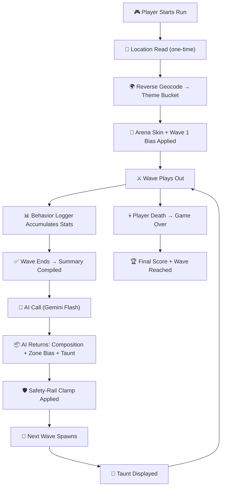

# 📋 PRD — Patient Zero: Protocol

> **Product Requirements Document** | v1.0 | September 2026
> KICKR Codemania 2026 — Gaming × AI Hackathon Submission (24-hour build)

---

## 1. Project Identity

| Field | Detail |
|---|---|
| **Name** | Patient Zero: Protocol |
| **Category** | Gaming × AI Hackathon Submission |
| **Platform** | Mobile (Android/iOS or mobile browser) |
| **Build Window** | 24 hours |
| **Engine** | Unity (default) or Three.js + PWA (web fallback) |

### One-Line Pitch

> A mobile wave-based zombie survival shooter where the entire difficulty system, enemy design, and narrative voice is driven by a live AI antagonist that reads how each specific player fights and adapts every subsequent wave to counter them — seeded at game-start by the player's real-world location.

### Core Design Philosophy

**One AI system, doing one job, visibly and mechanically.**

Patient Zero is not a chatbot feature. It is not decoration. The AI *is* the game's difficulty curve, *is* the game's antagonist character, and *is* the reason no two playthroughs are alike. Everything else in the game — shooting, movement, waves — exists to give that one AI system something meaningful to act on and a way to express its decisions.

### Real-World Problem & Impact

> [!IMPORTANT]
> **Hackathon Criterion: "Real-world problem & impact"**

Adaptive adversarial AI is a real, growing category:
- Fraud-detection evasion bots
- Anti-cheat evasion scripts
- Market-manipulation algorithms
- Phishing systems that adjust tactics based on target behavior

**Patient Zero is a playable, visceral demonstration of what it feels like to be on the receiving end of an opponent that studies and counters you specifically**, rather than one that simply scales in raw difficulty.

> *"Every adaptive AI system that opposes people in the real world — a scam bot, an evasive attacker, a manipulative algorithm — behaves like Patient Zero. We built a game that makes that abstract threat concrete and playable."*

---

## 2. Core Gameplay Loop

### Step-by-Step

1. **Game Start** — Single, one-time location read (device geolocation → reverse-geocoded → mapped to climate/theme bucket).
2. **Theme Seeding** — Location seed determines: visual theme of the arena (palette, skybox, fog) and a bias in Wave 1's enemy-type mix.
3. **Arena Entry** — Enclosed space with 2–3 chokepoints/pillars for cover.
4. **Controls** — Left-side virtual joystick (movement), right-side fire button (ranged), one cooldown-based special-ability button (AoE clear).
5. **Combat** — Player shoots (ranged, main input), melees automatically when zombie is within close proximity radius (no separate button).
6. **Wave Cycle** — Zombies spawn from 3 types (Standard, Fast, Tanky). Wave ends when all zombies cleared. Kills grant points.
7. **AI Decision** — End-of-wave behavior summary sent to Gemini → AI returns next wave composition, spawn bias, and taunt.
8. **Escalation** — Taunt displays; next wave spawns with AI-driven adaptation. Loop until player death.
9. **Game Over** — Final wave reached + score displayed.

### Design Intent

> [!TIP]
> The player should be able to **feel** the AI reacting to them specifically within 2–3 waves.

| Player Behavior | Expected AI Response |
|---|---|
| Camping a corner | Taunt acknowledges it + flanking-biased next wave |
| Ranged-only play | Taunt + melee-forcing tanky wave |
| Very fast wave clears | Moderate enemy count increase |
| Near-death survival | Escalation continues, taunt acknowledges near-loss |

---

## 3. Player Experience Goals

### First 30 Seconds
- Player understands controls immediately (joystick + fire + special)
- Arena theme reflects their real location — a moment of "oh, that's cool"
- First wave is manageable, establishing baseline combat feel

### First 3 Waves
- Player develops a comfort pattern (a favored corner, a preferred range)
- **Wave 2–3: the AI visibly reacts** — this is the "aha" moment
- Taunt text makes the adaptation explicit and personal

### Wave 5+
- Player is actively changing tactics, trying to outsmart the AI
- The game becomes a conversation: player adapts → AI adapts → player adapts
- Each run feels different because the AI responds to different player behaviors

---

## 4. Enemy Design

Three enemy types, all parameterized variations of a single base model:

| Type | HP | Speed | Damage | Attack Range | Visual Variant |
|---|---|---|---|---|---|
| **Standard** | Medium | Medium | Medium | Melee (close) | Default palette |
| **Fast** | Low | High | Low | Melee (close) | Desaturated, smaller scale |
| **Tanky** | High | Low | High | Melee only | Darker palette, larger scale |

> [!NOTE]
> All three types share a single base controller/prefab. Variation is achieved through stat parameters and visual properties (palette swap, scale adjustment) — **not** three separate codebases.

---

## 5. Location Seeding System

### Theme Buckets

| Bucket | Trigger Regions | Arena Palette | Enemy Theme Variant | Wave 1 Bias |
|---|---|---|---|---|
| `coastal` | Coastal cities, islands | Blue-grey fog, dark water tones | `drowned` | +Fast enemies |
| `desert` | Arid/semi-arid regions | Orange haze, sand tones | `scorched` | +Tanky enemies |
| `temperate` | Temperate zones, forests | Green-grey, overcast | `rotted` (default) | Balanced |
| `mountain` | High-altitude cities | White fog, cold blue tones | `frozen` | +Standard enemies |
| `urban` | Dense metro areas | Dark concrete, neon accents | `infected` | +Fast enemies |

### Fallback Behavior
- **Geolocation denied/unavailable** → Default to `temperate` bucket
- **Reverse geocode fails** → Use local hardcoded city→bucket lookup table
- **Unknown city** → Default to `temperate` bucket

---

## 6. UI/HUD Requirements

### In-Game HUD
- **HP Bar** — Player health, prominent top-left
- **Wave Counter** — Current wave number, top-center
- **Score** — Running point total, top-right
- **Taunt Bubble** — AI taunt text, appears post-wave for ~4 seconds, styled as clinical/terminal text
- **Special Ability Cooldown** — Visual cooldown indicator on the ability button

### Game Over Screen
- Final wave reached
- Total score
- Final Patient Zero taunt (a "closing observation")
- Restart button

---

## 7. Demo Narrative

> [!IMPORTANT]
> **Target duration: ~90 seconds live demo**

### Beat 1 — Real-World Hook (10–15s)

Show the location-seeding effect:
- **Option A:** Two devices with different location settings → visibly different arena themes/enemy variants
- **Option B:** Single live device showing its seeded theme with a one-line explanation

**Script:** *"Patient Zero reads your real-world location at game start. My arena is coastal because I'm in [city]. A player in Delhi would get a desert-scorched arena with different starting enemies."*

### Beat 2 — AI Adaptation (50–60s)

Play live, deliberately exhibit one clear playstyle:
1. Camp one chokepoint, use only ranged attacks
2. Let a wave complete
3. Show the taunt text appearing (e.g., *"Predictable. You favor the northern pillar. Adjusting."*)
4. Show the next wave visibly countering that exact behavior (spawn bias toward camped zone, tanky enemies forcing melee)

**Script:** *"Watch what happens when I keep camping this corner. The AI noticed — it's sending fast enemies from behind me and tanky enemies I can't kill at range."*

### Beat 3 — Closing Statement (10s)

> *"Patient Zero never operates as a chatbot or dialogue system. It only ever acts through gameplay consequences — spawns, positioning, taunts. It IS the game's difficulty system, its narrative voice, and the reason every playthrough differs. The AI doesn't assist the game. The AI IS the game."*

---

## 8. Success Criteria

### Hackathon Judging Alignment

| Criterion | How Patient Zero Addresses It |
|---|---|
| **AI Integration Depth** | AI is not a feature — it is the core game system. Remove it and the game has no difficulty curve, no narrative voice, no replayability. |
| **Real-World Problem** | Demonstrates adaptive adversarial AI in a visceral, playable format — the same behavioral pattern used by fraud bots, anti-cheat evasion, and social engineering systems. |
| **Technical Execution** | Structured AI I/O, one-call-per-wave architecture, safety rails, graceful fallbacks. |
| **User Experience** | The AI's adaptation is *felt* within 2–3 waves, not hidden behind menus or text boxes. |
| **Presentation** | 90-second demo with clear before/after demonstration of AI adaptation. |

### Minimum Viable Demo

- [ ] Player can move, shoot, and use special ability on mobile
- [ ] Location seeding produces a visible arena theme
- [ ] Waves spawn and escalate
- [ ] AI call returns valid composition + taunt after wave 1
- [ ] Taunt is displayed in HUD
- [ ] Wave 2+ composition visibly reflects player behavior
- [ ] Game over screen shows score and wave count

---

## 9. Constraints

| Constraint | Detail |
|---|---|
| **Time** | 24-hour hackathon build window |
| **Team** | Small team (2–5 people) |
| **AI Model** | Gemini Flash-tier (fast, cheap) |
| **Platform** | Mobile-first (touch controls required) |
| **No camera/mic** | Explicitly out of scope |
| **No voice synthesis** | Taunts are text-only |
| **Single arena** | One enclosed space, no level progression |

---

*This PRD is the single source of truth for what Patient Zero: Protocol is and why it exists. All other documents reference back to this one.*
