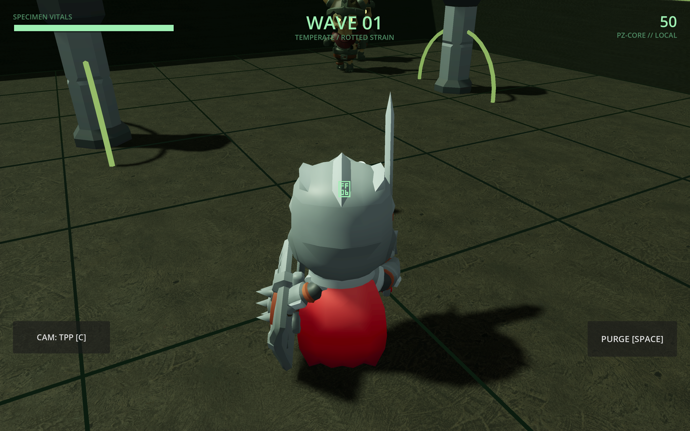
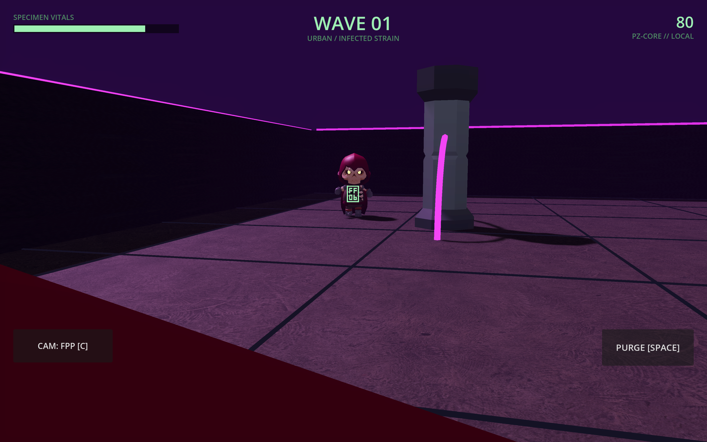

# 🧟 PATIENT ZERO: PROTOCOL

> **The villain is a live AI that profiles YOU — it studies your habits, remembers you between sessions, and when you die, it writes your autopsy report.**

[](https://docmagic.me/PATIENT-ZERO/)
[]()
[]()
[]()

| Third-Person | First-Person |
|:---:|:---:|
|  |  |

## 🎮 What is it?

A wave-survival arena shooter where **the difficulty system is an AI antagonist**. No chatbots, no dialogue trees — the AI reads your behavioral fingerprint (camping %, engagement range, kill style, favored zones) and composes every wave specifically to break YOUR habits. It persists across sessions. It writes your obituary.

**Study. Remember. Report.**

## 📸 Camera Modes

| Mode | Key | Feel |
|---|---|---|
| **TOP** | `C` | Tactical overhead — classic survivors-like |
| **TPP** | `C` | Over-the-shoulder action |
| **FPP** | `C` | First-person survival horror |

## 🧠 The AI (why it's not a wrapper)

- **PZ-CORE (local brain)** — deterministic adaptive rules: anti-camping flanks, anti-range tanky pressure, skill-scaled volume, *no rubber-banding ever*. Works with the network unplugged.
- **Gemini Flash** — optional richer taunts + autopsy prose (2.5s hard timeout, safety-railed, invisible fallback)
- **Nemesis Memory** — cross-session specimen profiles ("Specimen #7 returns. The north pillar missed you.")
- **Autopsy Report** — shareable AI-written death card with archetype + adaptability index

## 🏗 Repo Layout

| Path | What |
|---|---|
| `game/` | **Market build** — Godot 4.4 .NET (C#), 3D, CC0 asset packs |
| `src/` + `index.html` | **Web demo** — TS/canvas PWA for instant QR play ([live](https://docmagic.me/PATIENT-ZERO/)) |
| `docs/` | Design brain: [RESEARCH](docs/RESEARCH.md) · [WINNING_PLAN](docs/WINNING_PLAN.md) · [PRD](docs/PRD.md) · [BRAIN](docs/BRAIN.md) · [TECHSTACK](docs/TECHSTACK.md) · [DEMO](docs/DEMO.md) + more |

## 🚀 Run the Godot build

```bash
# Requires: Godot 4.4 .NET + .NET 8 SDK
cd game
dotnet build
godot --path .                          # play
godot --path . -- --theme=desert        # force biome
godot --path . -- --key=YOUR_GEMINI_KEY # enable Gemini brain
godot --headless --path . --script res://tests/SmokeTest.cs   # logic tests
```

**Controls:** WASD move · mouse aim/fire (click) · `SPACE` purge · `C` camera mode · touch: dual virtual sticks

## 🧩 Credits — open-source assets (CC0)

- [KayKit Skeletons + Adventurers + Dungeon Remastered](https://kaylousberg.com) — characters & environment
- [Poly Haven](https://polyhaven.com) — PBR concrete textures

*KICKR Codemania 2026 · The AI doesn't assist the game. The AI IS the game.*
