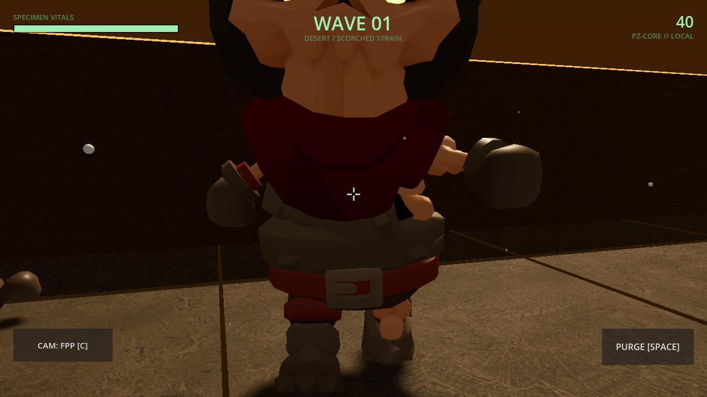
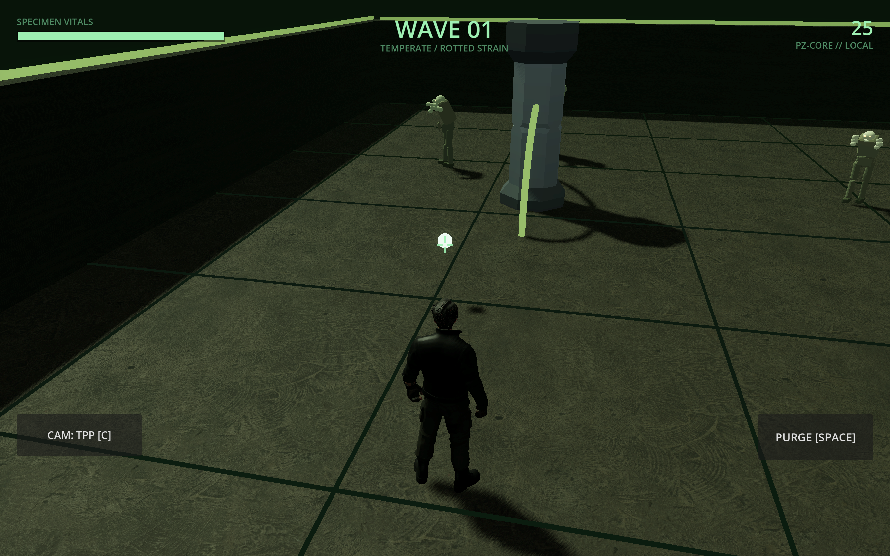

# PATIENT ZERO: PROTOCOL

> **The enemy is a live AI that studies how you fight, adapts the next wave, and writes your autopsy when you die.**

[](https://docmagic.me/PATIENT-ZERO/)
[](https://godotengine.org/)
[](https://dotnet.microsoft.com/languages/csharp)
[](https://ai.google.dev/)

## Real gameplay captures

These screenshots are committed in [`docs/assets`](docs/assets) and were captured from the Godot game build, not mockups.

| Third-person combat | First-person arena |
|:---:|:---:|
|  |  |

| Desert first-person view | Wave arena and medkit |
|:---:|:---:|
|  |  |

## What is Patient Zero?

**Patient Zero: Protocol** is a 3D zombie wave-survival shooter. The difficulty director is the antagonist: it records player behavior such as movement, engagement range, kill style, and preferred arena zones, then composes later waves to pressure those habits.

The game works offline through **PZ-CORE**, a deterministic local director. Gemini is optional and adds richer wave taunts and end-of-run autopsy prose when a runtime API key is supplied.

**Study. Remember. Report.**

## Gameplay

- Fight escalating waves of Standard, Fast, Tanky, and Gate Boss enemies.
- Switch between top-down, third-person, and first-person cameras.
- Use the pistol, AKM, and scattergun with muzzle flashes, orange AKM tracer fire, particles, and weapon audio.
- Pick up the wave-start medkit to restore up to 35 HP.
- Watch persistent bottom-screen VITALS, hit feedback, headshot guidance, score bonuses, and boss integrity.
- Review and share the themed PZ-CORE/Gemini autopsy report after death.
- Play with keyboard and mouse or the mobile movement joystick, FIRE button, and camera button.

## Controls

| Action | Desktop | Mobile |
|---|---|---|
| Move | `WASD` | Left virtual joystick |
| Aim / fire | Mouse | FIRE button |
| Camera | `C` | Camera button |
| Purge | `SPACE` | On-screen purge control |
| Restart after death | `ENTER` | On-screen report action |

## AI director

1. The game logs movement, range, kills, damage, and zone choices during each wave.
2. The local director converts that behavior into a wave composition, spawn bias, and taunt.
3. If Gemini is configured, it can enrich the taunt and autopsy while the same safety rails clamp its output.
4. If the network or key is unavailable, PZ-CORE continues locally with no gameplay interruption.

Gemini is configured at runtime and is intentionally not stored in the repository:

```bash
./pz.sh --key=YOUR_GEMINI_KEY
```

## Run the Godot build

### Requirements

- macOS, Windows, or Linux
- Godot **4.4.1 .NET / Mono**
- .NET 8 SDK

### Build and launch

```bash
cd game
dotnet build
cd ..
./pz.sh
```

Useful commands:

```bash
./pz.sh --theme=desert
./pz.sh --mobile
./pz.sh --headless --import
./pz.sh --screenshot --cam=tpp
```

The launcher sets `DOTNET_ROOT` for the bundled .NET installation. Screenshot output, when supported by the local renderer, is written to `/tmp/pz_shot.png`; diagnostic lines are written to `/tmp/pz_debug.log`.

## Repository layout

| Path | Purpose |
|---|---|
| `game/` | Godot 4.4.1 .NET game, C# gameplay code, scenes, and assets |
| `game/scripts/GameRoot3D.cs` | Gameplay loop, rendering, weapons, UI, mobile controls, and pickups |
| `game/scripts/PatientZeroBrain.cs` | Gemini integration and deterministic local fallback |
| `game/scripts/Config.cs` | Gameplay tuning, weapons, themes, and runtime configuration |
| `docs/assets/` | Real gameplay screenshots used in this README |
| `docs/` | Design, research, architecture, and demo documentation |
| `pz.sh` | Godot launcher with .NET environment setup |

## Credits

- [KayKit Skeletons, Adventurers, and Dungeon Remastered](https://kaylousberg.com) — characters and environment assets
- [Poly Haven](https://polyhaven.com) — PBR textures

*KICKR Codemania 2026 · The AI doesn't assist the game. The AI is the game.*
