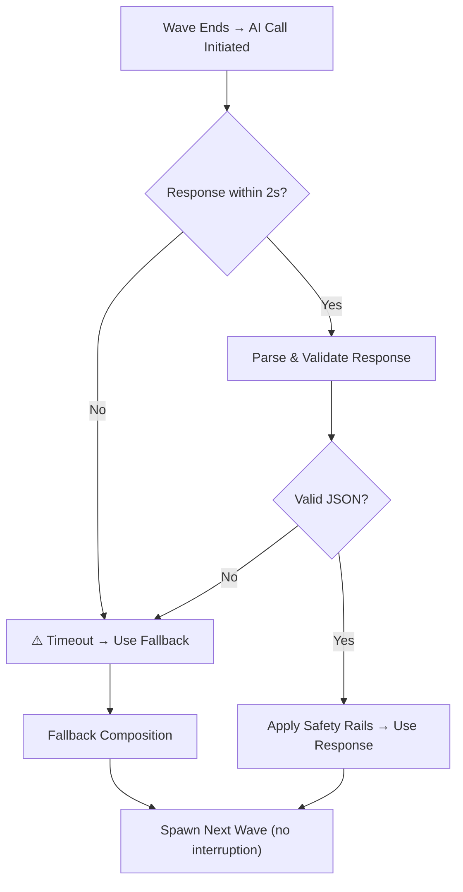
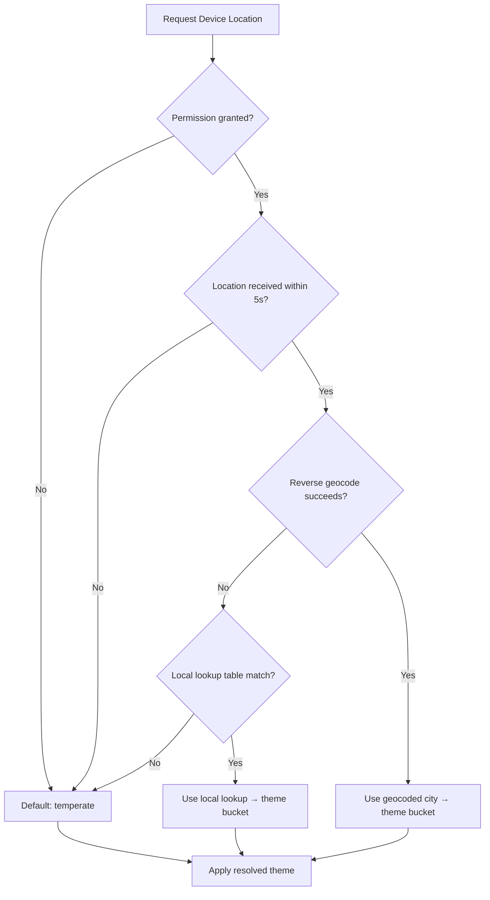

# 🛡️ SAFETY — Safety Rails & Failure Handling

> **Safety & Resilience Document** | v1.0 | September 2026
> Comprehensive failure modes, fallbacks, and safety rails for Patient Zero: Protocol.

---

## 1. Design Principle

> [!IMPORTANT]
> **The game must NEVER break, stall, or show a loading state to the player due to an external dependency failure.** Every external system (AI API, geolocation, reverse geocode) has a local fallback that allows gameplay to continue seamlessly.

---

## 2. AI Output Safety Rails

### 2.1 Output Clamping

Regardless of what the AI model returns, enforce hard bounds **before** passing data to the spawner:

| Constraint | Minimum | Maximum | Fallback on Violation |
|---|---|---|---|
| Standard enemy count | 1 | 15 | Clamp to nearest bound |
| Fast enemy count | 1 | 15 | Clamp to nearest bound |
| Tanky enemy count | 1 | 15 | Clamp to nearest bound |
| **Total enemies per wave** | **3** | **30** | Scale proportionally to fit within bounds |
| Taunt text length | 1 char | 100 chars | Truncate or use fallback taunt |

### Clamping Algorithm

```
1. Parse AI response → extract standard, fast, tanky counts
2. Clamp each individually: max(1, min(15, value))
3. Calculate total = standard + fast + tanky
4. If total > 30:
   - Scale each type proportionally: type = round(type * 30 / total)
   - Ensure each type ≥ 1 after scaling
5. If total < 3:
   - Set standard = max(standard, 1), fast = max(fast, 1), tanky = max(tanky, 1)
6. Pass clamped values to spawner
```

### 2.2 Schema Validation

Before using any AI response field, validate it exists and has the correct type:

| Field | Expected Type | Valid Values | On Invalid |
|---|---|---|---|
| `next_wave_composition` | object | Contains `standard`, `fast`, `tanky` as integers | Use fallback composition |
| `next_wave_composition.standard` | integer | 0–100 (pre-clamp) | Default: `wave_number + 1` |
| `next_wave_composition.fast` | integer | 0–100 (pre-clamp) | Default: `max(1, wave_number / 2)` |
| `next_wave_composition.tanky` | integer | 0–100 (pre-clamp) | Default: `max(1, wave_number / 3)` |
| `spawn_zone_bias` | string | `north_chokepoint`, `center_open`, `south_pillar`, `east_flank`, `balanced` | Default: `balanced` |
| `taunt_text` | string | Non-empty, ≤ 100 chars | Default: `"..."` |
| `enemy_theme_variant` | string | `drowned`, `scorched`, `rotted`, `frozen`, `infected` | Default: `rotted` |

### 2.3 Taunt Content Sanitization

- Strip any HTML/markdown formatting
- Remove any content that isn't plain text (URLs, code blocks, etc.)
- Truncate to 100 characters maximum
- If the taunt contains the word "sorry" or any apologetic/helpful tone, replace with fallback (Patient Zero never apologizes)
- If empty after sanitization, use `"Recalculating..."`

---

## 3. AI Call Failure Modes

### 3.1 Timeout Handling



**Timeout threshold:** 2 seconds (hard limit, non-negotiable)

**Player experience during timeout:** None. No loading spinner, no "waiting for AI" message. The intermission period naturally provides ~3 seconds of buffer. If the AI responds within 2s, the taunt appears. If not, the wave spawns from fallback and the player never knows the AI failed.

### 3.2 Fallback Composition Table

When the AI call fails for any reason, use this deterministic fallback:

```
Fallback for wave N:
  standard: N + 1
  fast:     max(1, floor(N / 2))
  tanky:    max(1, floor(N / 3))
  spawn_zone_bias: "balanced"
  taunt_text: "..."
```

| Wave | Standard | Fast | Tanky | Total |
|---|---|---|---|---|
| 1 | 2 | 1 | 1 | 4 |
| 2 | 3 | 1 | 1 | 5 |
| 3 | 4 | 1 | 1 | 6 |
| 4 | 5 | 2 | 1 | 8 |
| 5 | 6 | 2 | 1 | 9 |
| 6 | 7 | 3 | 2 | 12 |
| 7 | 8 | 3 | 2 | 13 |
| 8 | 9 | 4 | 2 | 15 |
| 9 | 10 | 4 | 3 | 17 |
| 10 | 11 | 5 | 3 | 19 |

### 3.3 Failure Type Catalog

| Failure | Cause | Detection | Response |
|---|---|---|---|
| **Network timeout** | Slow/no internet | 2s timeout fires | Fallback composition |
| **HTTP error (4xx/5xx)** | API issue, rate limit, bad key | HTTP status code | Fallback composition, log error |
| **Malformed JSON** | Model hallucinated non-JSON | JSON parse exception | Fallback composition |
| **Missing fields** | Model omitted required fields | Schema validation | Fill missing with defaults, use partial response |
| **Out-of-range values** | Model returned extreme numbers | Bounds check | Clamp values, use modified response |
| **Empty response** | Model returned blank | Length check | Fallback composition |
| **Invalid enum value** | Model returned unknown zone name | Enum validation | Default to `balanced` |

---

## 4. Geolocation Failure Modes

### 4.1 Permission Denied

- **Trigger:** User denies location permission prompt
- **Response:** Default to `temperate` theme bucket
- **Player experience:** Game starts immediately with default theme, no error shown

### 4.2 Location Timeout

- **Trigger:** Geolocation API takes >5 seconds
- **Response:** Cancel request, default to `temperate`
- **Player experience:** Game starts immediately, no delay

### 4.3 Reverse Geocode Failure

- **Trigger:** Network error on reverse geocode API call
- **Response:** Use local hardcoded city→bucket lookup table
- **Fallback table:** (see [PLAN.md](file:///d:/Projects/PATIENT-ZERO/PLAN.md) Section 5.2)
- **If coordinates don't match any entry:** Default to `temperate`

### 4.4 Fallback Chain



---

## 5. Runtime Error Handling

### 5.1 Enemy Pathfinding Failure

- **Trigger:** NavMesh cannot find path to player (player in unreachable position)
- **Response:** Enemy uses simple direct-steering fallback (move straight toward player, ignoring obstacles)
- **Prevention:** Arena design ensures all positions are on the NavMesh

### 5.2 Spawn Point Blocked

- **Trigger:** Spawn point is inside a collider or already occupied
- **Response:** Try next available spawn point in same zone; if all blocked, use any available spawn point in any zone

### 5.3 Memory/Performance

- **Max active enemies:** 30 (hard cap via safety rail)
- **Enemy pooling:** Reuse enemy instances rather than destroy/instantiate (optional optimization)
- **If framerate drops below 30 FPS:** Log warning, but no dynamic scaling (not worth complexity in hackathon)

---

## 6. Data Integrity

### 6.1 Behavior Logger Edge Cases

| Edge Case | Handling |
|---|---|
| Wave with 0 kills (shouldn't happen, but…) | Set all kill percentages to 0.0, skip kill-distance averages |
| Wave lasting <1 second | Set all time percentages to 0.5 (neutral), clear time = actual |
| Player at exactly 0 HP at wave end | This should trigger death before wave-end. If race condition: treat as death |
| Division by zero (totalKills = 0) | Guard all divisions with zero checks; use 0.0 as default |

### 6.2 AI Input Validation

Before sending behavior summary to AI, validate:

| Field | Validation | Fix |
|---|---|---|
| `time_stationary_pct + time_moving_pct` | Should = 1.0 (±0.01) | Normalize to sum 1.0 |
| `kills_ranged_pct + kills_melee_pct` | Should = 1.0 (±0.01) | Normalize to sum 1.0 |
| `avg_engagement_distance` | Should be > 0 | Default to 5.0 if 0 |
| `avg_distance_to_cover` | Should be > 0 | Default to 10.0 if 0 |
| `wave_clear_time_seconds` | Should be > 0 | Default to 30.0 if 0 |
| `player_hp_remaining_pct` | Should be 0.0–1.0 | Clamp to range |

---

## 7. Demo-Specific Safeguards

> [!WARNING]
> During a live demo, network and device behavior is unpredictable. These safeguards exist specifically for demo reliability.

| Risk | Safeguard |
|---|---|
| Demo WiFi is slow/unreliable | All fallbacks ensure game is fully playable offline |
| API key expires or is rate-limited | Fallback compositions keep the game going |
| Device location returns incorrect coords | Local lookup table covers likely demo cities |
| AI returns inappropriate taunt | Sanitization filter + manual review of system prompt |
| Game crashes | Test on actual demo device; keep a pre-recorded backup video |
| Battery dies during demo | Charge device to 100%; keep a charger handy |

### Pre-Demo Checklist

- [ ] API key is valid (make a test call)
- [ ] Game builds and runs on demo device
- [ ] Geolocation works (or fallback is verified)
- [ ] AI call returns within 2 seconds on demo network
- [ ] Fallback composition works when API is disabled
- [ ] Game over screen works correctly
- [ ] Backup video is recorded and accessible
- [ ] Device is charged to 100%

---

## 8. Logging & Debugging

### What to Log (Debug Builds Only)

| Event | Log Content |
|---|---|
| AI call sent | Full behavior summary JSON |
| AI call received | Full AI response JSON |
| AI call timeout | Timestamp, timeout threshold |
| AI call error | Error type, message, stack trace |
| Safety rail activated | Which rail fired, original value → clamped value |
| Geolocation result | Lat/lng or failure reason |
| Theme bucket resolved | Bucket name, resolution method (geocode/lookup/default) |
| Fallback used | Which fallback (AI/geo/theme) and why |

### Log Format

```
[PATIENT-ZERO] [TIMESTAMP] [CATEGORY] [LEVEL] Message
[PATIENT-ZERO] 2026-09-12T14:23:45 [AI] [INFO] Call sent: wave=3, summary={...}
[PATIENT-ZERO] 2026-09-12T14:23:46 [AI] [INFO] Response received: 1.2s, composition={...}
[PATIENT-ZERO] 2026-09-12T14:23:46 [SAFETY] [WARN] Clamped tanky count: 20 → 15
```

---

*This document ensures Patient Zero is resilient in all failure scenarios. The game must always be playable, especially during a live demo.*
