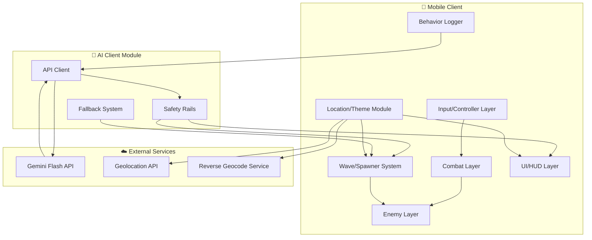
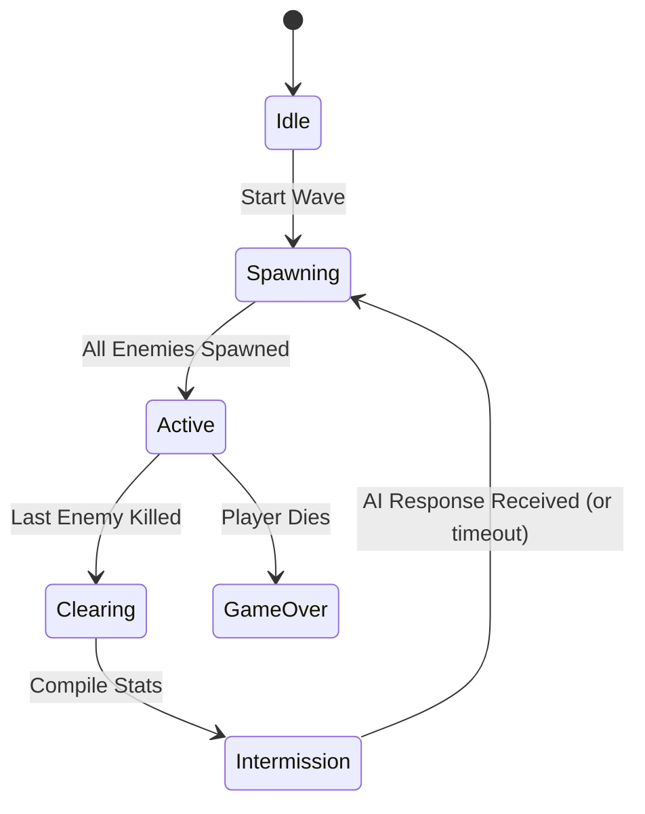
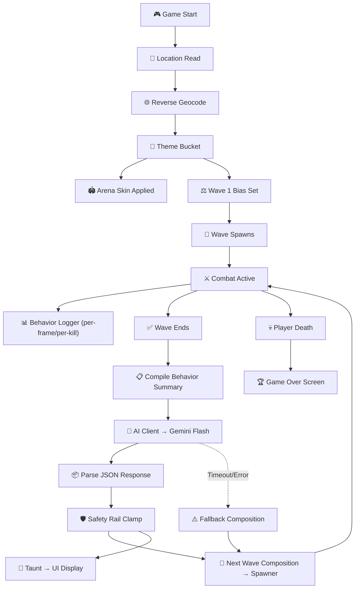
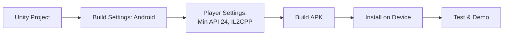
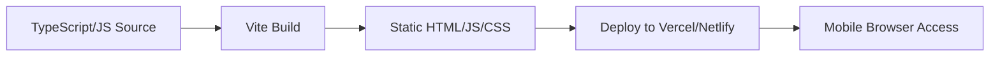

# 🔧 TECHSTACK — Technical Architecture

> **Technical Architecture Document** | v1.0 | September 2026
> System components, data flow, and infrastructure for Patient Zero: Protocol.

---

## 1. Stack Overview



---

## 2. Recommended Stack

### Primary: Unity (Recommended)

| Component | Technology | Rationale |
|---|---|---|
| **Engine** | Unity 2022 LTS+ | Built-in mobile support, NavMesh, touch input, fast iteration |
| **Language** | C# | Unity's native language, team familiarity |
| **Platform** | Android (primary), iOS (stretch) | Most accessible for demo |
| **AI Communication** | `UnityWebRequest` | Built-in HTTP client, async support |
| **UI Framework** | Unity UI Toolkit or uGUI | Built-in, no dependencies |
| **Navigation** | NavMesh | Built-in pathfinding for enemies |
| **Input** | Unity Input System | Touch support, virtual joystick |

### Alternative: Web-Based (Only if team's strongest skillset)

| Component | Technology | Rationale |
|---|---|---|
| **Engine** | Three.js + custom game loop | Lightweight 3D, runs in mobile browser |
| **Language** | TypeScript/JavaScript | Web-native |
| **Platform** | Mobile browser (PWA) | No app store needed for demo |
| **AI Communication** | `fetch` API | Native browser HTTP client |
| **UI Framework** | HTML/CSS overlay on canvas | Simple, fast to build |
| **Navigation** | Custom A* or steering | No built-in NavMesh |
| **Input** | Touch events / Hammer.js | Web touch handling |

> [!WARNING]
> Do **not** adopt a new engine on hackathon day. Use whichever stack the team is most proficient with. Unity is recommended only if the team has existing Unity experience.

---

## 3. System Components — Detailed

### 3.1 Input/Controller Layer

**Responsibility:** Capture and process player input from mobile touch controls.

**Components:**
- `VirtualJoystick` — Left-side touch area, outputs a normalized 2D direction vector
- `FireButton` — Right-side tap, triggers ranged attack with fire-rate cooldown
- `SpecialAbilityButton` — Right-side secondary, triggers AoE with cooldown timer
- `InputManager` — Aggregates all input sources into a unified player-intent object

**Interface:**
```csharp
public class PlayerInput {
    public Vector2 moveDirection;    // Normalized, from joystick
    public bool firePressed;          // True on frame fire is triggered
    public bool specialPressed;       // True on frame special is triggered
}
```

### 3.2 Combat Layer

**Responsibility:** Damage calculation, projectile management, melee proximity detection.

**Components:**
- `ProjectileSystem` — Spawns and manages ranged projectiles, handles collision
- `MeleeDetector` — Sphere/circle overlap check around player (~1.5 unit radius)
- `DamageSystem` — Applies damage to entities (player and enemies), fires kill events
- `SpecialAbility` — AoE damage in radius, cooldown management

**Key Events:**
```csharp
public event Action<KillData> OnEnemyKilled;
// KillData: { enemyType, killType (ranged/melee), distance, position }

public event Action<float> OnPlayerDamaged;
// float: damage amount

public event Action OnPlayerDeath;
```

### 3.3 Enemy Layer

**Responsibility:** Enemy behavior, pathfinding, and attack logic.

**Components:**
- `EnemyController` — Single base class parameterized by `EnemyConfig`
- `EnemyConfig` — Data object defining stats and visuals per type

```csharp
[System.Serializable]
public class EnemyConfig {
    public string typeName;         // "standard", "fast", "tanky"
    public float maxHP;
    public float moveSpeed;
    public float damage;
    public float attackRange;
    public float attackCooldown;
    public float scaleFactor;
    public Color colorTint;
}
```

**Configurations:**

| Config | maxHP | moveSpeed | damage | attackRange | scale | color |
|---|---|---|---|---|---|---|
| `Standard` | 100 | 3.0 | 10 | 1.5 | 1.0 | Grey |
| `Fast` | 50 | 6.0 | 5 | 1.5 | 0.8 | Pale |
| `Tanky` | 250 | 1.5 | 20 | 2.0 | 1.3 | Dark |

**Pathfinding:**
- Unity: NavMeshAgent component on enemy prefab
- Web: Simple steering behavior (seek player, avoid obstacles)
- Enemies always path toward current player position
- Attack when within `attackRange`

### 3.4 Wave/Spawner System

**Responsibility:** Manage wave lifecycle, spawn enemies per composition, track wave state.

**Components:**
- `WaveManager` — Controls state machine: `Idle → Spawning → Active → Clearing → Intermission`
- `EnemySpawner` — Instantiates enemies at designated spawn points
- `SpawnPointRegistry` — Maps zone names to spawn point transforms

**State Machine:**


**Spawn Point Layout:**
```
Zone: north_chokepoint → SpawnPoints: NW1, NW2, NE1, NE2
Zone: center_open      → SpawnPoints: C1, C2, C3
Zone: south_pillar      → SpawnPoints: SW1, SE1
Zone: east_flank        → SpawnPoints: E1, E2
```

**Zone Bias Logic:**
- `spawn_zone_bias = "north_chokepoint"` → 60% of enemies spawn from north points, 40% distributed
- `spawn_zone_bias = "balanced"` → Equal distribution across all zones

### 3.5 Behavior Logger

**Responsibility:** Track player behavior metrics throughout each wave.

**Components:**
- `BehaviorLogger` — Singleton that accumulates per-frame and per-kill data
- `BehaviorSummary` — Data class matching the AI input schema

**Tracking Implementation:**
```csharp
// Per-frame (called in Update)
void TrackFrame(float deltaTime) {
    totalTime += deltaTime;
    float velocity = player.velocity.magnitude;
    
    if (velocity < STATIONARY_THRESHOLD) {
        stationaryTime += deltaTime;
    } else {
        movingTime += deltaTime;
    }
    
    float distToCover = FindNearestCoverDistance(player.position);
    totalCoverDistance += distToCover;
    frameCount++;
}

// Per-kill (called from DamageSystem.OnEnemyKilled)
void TrackKill(KillData data) {
    totalKills++;
    if (data.killType == KillType.Ranged) rangedKills++;
    else meleeKills++;
    totalEngagementDistance += data.distance;
}
```

### 3.6 AI Client Module

**Responsibility:** Communicate with Gemini API, parse responses, enforce safety rails.

**Components:**
- `AIClient` — Handles API calls (request construction, async send, response parsing)
- `SafetyRails` — Validates and clamps AI responses before passing to game systems
- `FallbackProvider` — Generates default wave compositions when AI is unavailable

**API Call Flow:**
```csharp
async Task<AIDecision> GetNextWaveDecision(BehaviorSummary summary) {
    string systemPrompt = LoadSystemPrompt();
    string userMessage = JsonSerializer.Serialize(summary);
    
    try {
        var response = await CallGeminiAPI(systemPrompt, userMessage, timeoutMs: 2000);
        var decision = ParseAIResponse(response);
        return SafetyRails.Clamp(decision);
    } catch (TimeoutException) {
        return FallbackProvider.GetFallback(summary.wave_number);
    } catch (Exception e) {
        LogError(e);
        return FallbackProvider.GetFallback(summary.wave_number);
    }
}
```

**Safety Rail Clamping:**
```csharp
public static AIDecision Clamp(AIDecision raw) {
    var clamped = new AIDecision();
    
    // Clamp per-type: min 1, max 15
    clamped.standard = Mathf.Clamp(raw.standard, 1, 15);
    clamped.fast = Mathf.Clamp(raw.fast, 1, 15);
    clamped.tanky = Mathf.Clamp(raw.tanky, 1, 15);
    
    // Clamp total: min 3, max 30
    int total = clamped.standard + clamped.fast + clamped.tanky;
    if (total > 30) ScaleDown(clamped, 30);
    if (total < 3) ScaleUp(clamped, 3);
    
    // Validate zone bias
    if (!VALID_ZONES.Contains(raw.spawn_zone_bias))
        clamped.spawn_zone_bias = "balanced";
    else
        clamped.spawn_zone_bias = raw.spawn_zone_bias;
    
    // Sanitize taunt
    clamped.taunt_text = SanitizeText(raw.taunt_text, maxLength: 100);
    
    return clamped;
}
```

### 3.7 UI/HUD Layer

**Responsibility:** Display game state, taunt text, and game-over screen.

**Components:**
- `HUDController` — Updates HP bar, wave counter, score in real-time
- `TauntDisplay` — Typewriter-style text reveal, auto-dismiss timer
- `GameOverScreen` — Overlay with final stats and restart button

**Taunt Display Behavior:**
```
Trigger: AI response received
→ Appear with subtle glitch/flicker effect
→ Typewriter text reveal (~50ms per character)
→ Hold for 4 seconds
→ Fade out (or dismiss on next wave start)
Font: Monospace/terminal (JetBrains Mono, Source Code Pro, or similar)
Style: Semi-transparent dark background, green or amber text
```

### 3.8 Location/Theme Seeding Module

**Responsibility:** One-time location read at game start, map to theme, apply to arena.

**Components:**
- `LocationService` — Device geolocation access
- `GeocodeService` — Reverse geocode (API or local lookup)
- `ThemeManager` — Apply theme bucket to arena visuals

**Theme Application:**
```csharp
[System.Serializable]
public class ArenaTheme {
    public string bucketName;       // "coastal", "desert", etc.
    public Color skyboxTint;
    public Color fogColor;
    public float fogDensity;
    public Color floorColor;
    public Color ambientLight;
    public float ambientIntensity;
    public Color pillarTint;
}
```

---

## 4. Data Flow Diagram



---

## 5. API Integration Details

### Gemini API Call

**Endpoint:** `https://generativelanguage.googleapis.com/v1beta/models/gemini-2.0-flash:generateContent`

**Request Structure:**
```json
{
  "contents": [
    {
      "role": "user",
      "parts": [
        {
          "text": "{behavior_summary_json}"
        }
      ]
    }
  ],
  "systemInstruction": {
    "parts": [
      {
        "text": "{system_prompt_from_BRAIN.md}"
      }
    ]
  },
  "generationConfig": {
    "temperature": 0.7,
    "responseMimeType": "application/json",
    "responseSchema": {
      "type": "object",
      "properties": {
        "next_wave_composition": {
          "type": "object",
          "properties": {
            "standard": {"type": "integer"},
            "fast": {"type": "integer"},
            "tanky": {"type": "integer"}
          }
        },
        "spawn_zone_bias": {"type": "string"},
        "taunt_text": {"type": "string"},
        "enemy_theme_variant": {"type": "string"}
      }
    }
  }
}
```

**Response Handling:**
1. Check HTTP status (200 OK)
2. Parse outer Gemini response envelope
3. Extract `candidates[0].content.parts[0].text`
4. Parse inner JSON (the AI's structured decision)
5. Validate against expected schema
6. Apply safety rails
7. Forward to game systems

### API Key Security

> [!CAUTION]
> **Never hardcode API keys in source code or version control.**

**Options (in order of preference):**
1. **Environment variable** — Set `GEMINI_API_KEY` in build config or device environment
2. **Minimal proxy server** — Lightweight backend that holds the key, forwards requests to Gemini
3. **Unity ScriptableObject** — Excluded from Git via `.gitignore`, loaded at runtime (acceptable for hackathon only)

### Geolocation API

**Unity:**
```csharp
IEnumerator GetLocation() {
    Input.location.Start();
    int maxWait = 5; // seconds
    while (Input.location.status == LocationServiceStatus.Initializing && maxWait > 0) {
        yield return new WaitForSeconds(1);
        maxWait--;
    }
    if (Input.location.status == LocationServiceStatus.Running) {
        float lat = Input.location.lastData.latitude;
        float lng = Input.location.lastData.longitude;
        // → reverse geocode
    } else {
        // → fallback to "temperate"
    }
}
```

**Web:**
```javascript
navigator.geolocation.getCurrentPosition(
    (pos) => {
        const { latitude, longitude } = pos.coords;
        // → reverse geocode
    },
    (err) => {
        // → fallback to "temperate"
    },
    { timeout: 5000 }
);
```

---

## 6. Build & Deploy

### Unity Build Pipeline



**Build Settings:**
- Platform: Android
- Minimum API Level: 24 (Android 7.0)
- Scripting Backend: IL2CPP (for performance) or Mono (for faster build during hackathon)
- Architecture: ARM64

### Web Build Pipeline



---

## 7. Performance Targets

| Metric | Target | Rationale |
|---|---|---|
| Frame Rate | 60 FPS on mid-tier mobile | Smooth gameplay feel |
| AI Call Latency | < 2 seconds | Must not block gameplay flow |
| Input Latency | < 16ms (1 frame) | Responsive controls |
| Enemy Count | Up to 30 on screen | Maximum AI-prescribed wave size |
| Memory Usage | < 500MB | Mid-tier mobile constraint |
| APK Size | < 100MB | Quick install for demo |

---

*This document defines HOW Patient Zero is built. Refer to [PRD.md](file:///d:/Projects/PATIENT-ZERO/PRD.md) for WHAT and [BRAIN.md](file:///d:/Projects/PATIENT-ZERO/BRAIN.md) for the AI system design.*
