# 🏆 WINNING_PLAN — The Path to First Place

> **Winning Strategy Document** | v1.0 | September 2026
> What we add, what we borrow, and how we demo to win KICKR Codemania 2026.
> **Read this first. Everything else serves this document.**

---

## 1. 🎯 THE USP (Memorize This)

> ### "A zombie shooter where the villain is a live AI that profiles YOU — it studies your habits, remembers you between sessions, and when you die, it writes your autopsy report."

**The three pillars — Study. Remember. Report.**

| # | Pillar | What it means | Status |
|---|---|---|---|
| 1 | **It studies you** | Every wave, an LLM reads YOUR behavioral fingerprint (camping %, engagement range, kill style) and composes the next wave specifically to break YOUR habits | ✅ In base plan |
| 2 | **It remembers you** | Patient Zero persists across sessions. Restart the game and it greets you: *"Welcome back, Specimen #7. Your camping habit persists."* It's a nemesis, not amnesiac difficulty | 🆕 Upgrade A |
| 3 | **It reports you** | On death, the AI writes your **Autopsy Report** — a clinical behavior profile ("Archetype: The Camper. Cause of death: flanked while stationary") rendered as a shareable card | 🆕 Upgrade B |

### The Anti-Washing Statement (our differentiation)

> Every hackathon is full of "AI features" — chatbots bolted onto apps. Patient Zero takes the opposite position: **zero chat, zero prompts, zero dialogue.** The AI never talks *to* you. It only acts *on* you — through spawns, positioning, taunts, and your final report.
>
> **The player never types a word, yet the game is unplayable without the AI.** Remove it: no difficulty curve, no nemesis, no memory, no autopsy, no replayability. That is "AI as the system," not "AI as a feature."

### The One-Liner for Judges

> "Every hackathon has games with AI features. We built a game where **you** are the AI's feature — you are its lab specimen."

---

## 2. 🏅 Why This Wins — Judging Criteria Matrix

| Criterion | Base plan score | With upgrades | Why |
|---|---|---|---|
| **AI Integration Depth** | Strong | **Unmatched** | AI drives difficulty (waves), narrative (taunts), persistence (memory), and meta-game (shareable autopsy). Four AI-powered systems, zero chatbot. Specimen Mode shows the AI's reasoning live on screen — judges SEE it think. |
| **Real-World Problem** | Abstract | **Concrete** | Adaptive adversarial AI = fraud bots, scam scripts, social engineering. The Autopsy Report makes it visceral: "this is a profile of how you behave when attacked — scammers build exactly this about you." |
| **Technical Execution** | Solid | **Solid + showable** | Structured JSON I/O, safety rails, hard timeouts, graceful fallbacks, offline-safe. Specimen Mode exposes the pipeline for technical judges. |
| **User Experience** | Good | **Viral** | The "aha" moment lands in 2–3 waves. The Autopsy card gives players a reason to screenshot and share — free distribution, Wordle-style. |
| **Presentation** | Good | **Unforgettable** | QR code finale: judges play on their own phones during Q&A and get profiled live. No other team will hand the demo to the judges. |

> [!IMPORTANT]
> **The winning demo move:** end the presentation by turning judges into specimens. Details in Section 6.

---

## 3. 📚 Best References — What We Borrow, What We Beat

We stand on the shoulders of the greatest adaptive-AI games ever shipped. Each reference contributes one proven idea; each is also a foil we explicitly surpass.

| Reference | What it proved | What we take | How we beat it |
|---|---|---|---|
| **Left 4 Dead — AI Director** (Valve, 2008) | Invisible adaptive pacing creates infinite replay tension | Tension curve philosophy: waves should breathe (pressure → release → spike). Taunts mark the "director's hand" visibly | L4D's Director = hand-authored rules over *group* stress metrics, and it stays invisible. Ours is an LLM reasoning over an *individual* fingerprint, and it **shows its work** — taunts + Specimen Mode + autopsy |
| **Alien: Isolation** (Creative Assembly, 2014) | An antagonist that hunts *you* feels like a character, not a system | Antagonist-as-character: Patient Zero has a voice, a temperament, and consistency across the whole game | The Xenomorph never learns — its genius was authored behavior trees. Ours changes strategy *per player, per session*, and remembers you tomorrow |
| **Hello Neighbor** (Dynamic Pixels, 2017) | AI exploiting the player's habits is a compelling core mechanic | Habit-exploitation as the central loop (camp → get flanked) | It only memorized routes with heuristics. Ours composes open-ended counter-strategies (composition + spawn geometry + pacing) from behavioral statistics |
| **PAC-MAN ghosts** (Namco, 1980) | Four lines of code each, distinct readable personalities, 45 years of fame | Readable enemy archetypes (Fast = flanker, Tanky = pressure, Standard = baseline) and **prediction**: Pinky targets 4 tiles *ahead* of Pac-Man; our `spawn_zone_bias` targets where you're *about to be* | — (humility anchor: personality > polygons) |
| **Wordle** (Wardle, 2022) | A shareable result card is zero-budget viral distribution | The **Autopsy Report card**: emoji-grid + archetype + specimen number + AI's closing remark. Copy-to-clipboard, one-tap share | Most games' "share score" is a number. Ours is an *AI-written character judgment of you* — inherently more shareable |
| **Resident Evil 4 dynamic difficulty** (Capcom, 2005) | The **anti-reference**: invisible rubber-banding that secretly helps struggling players | What NOT to do. We invert it publicly: **no rubber-banding, ever** (BRAIN.md Rule 4). Low HP = more pressure + a taunt acknowledging your fragility | — |

> [!TIP]
> In Q&A, name-dropping this table signals genuine games-AI literacy. "Left 4 Dead's Director managed stress statistics; ours reasons about an individual — and it remembers them" is a kill-shot answer.

---

## 4. 🆕 The Three Upgrades (Deltas Over Base Plan)

### Upgrade A — Nemesis Memory (cross-session persistence)

**What:** `localStorage` stores a specimen profile: `{ specimen_number, run_count, last_3_wave_summaries[], best_wave, best_score, dominant_archetype }`. On every AI call, the last 2–3 summaries + specimen number are injected into context. On game start, a "greeting" taunt references past behavior.

**Why it wins:** Turns "adaptive difficulty" into "a villain with a persistent grudge." This single feature moves the project from *clever mechanic* to *memorable character*. Judges who replay the game (via QR) experience being *recognized* — the strongest emotional proof of AI depth available in a 3-minute interaction.

**Cost:** ~45 min. Schema change + localStorage layer + prompt injection.

```json
// Added to AI input schema
{
  "specimen_number": 7,
  "run_count": 3,
  "previous_run_summary": {
    "waves_survived": 6,
    "dominant_archetype": "camper",
    "cause_of_death": "flanked while stationary"
  }
}
```

**Greeting examples:**
- Run 2, was a camper: *"Specimen #7 returns. The north pillar missed you."*
- Run 2, died fast: *"Second session. Shorter than the first. Noted."*
- Run 5: *"Persistence despite evidence. Fascinating."*

### Upgrade B — The Autopsy Report (shareable death card)

**What:** A second AI call at game over. Input: full run history + per-wave summaries. Output: structured "Specimen Report" — archetype, cause of death, adaptability index (how much you changed tactics between waves), closing remark. Rendered as a terminal-styled card (canvas → PNG), with copy-to-clipboard share text.

**Why it wins:**
1. **It's the demo's closing beat** — dying on stage becomes the payoff, not the failure.
2. **It's the viral loop** — players share a personality judgment of themselves (Wordle proved people love this).
3. **It's the real-world hook made visceral** — "this is a behavioral profile, the same thing scam bots build about their targets."

**Output schema:**

```json
{
  "archetype": "The Camper",
  "cause_of_death": "Flanked by fast-type specimens while stationary at north pillar",
  "adaptability_index": 0.42,
  "weakness_documented": "Abandoned repositioning under pressure",
  "closing_remark": "Specimen #7 resisted adaptation. Terminated.",
  "share_text": "🧟 PATIENT ZERO — Specimen #7 | Wave 6 | 231 kills | Archetype: The Camper | \"Resisted adaptation. Terminated.\""
}
```

**Card layout (terminal aesthetic):**

```
┌─ AUTOPSY REPORT ────────────────────────┐
│  SPECIMEN #7          RUN 3   WAVE 6    │
│                                          │
│  ARCHETYPE      The Camper               │
│  KILLS          231                      │
│  ADAPTABILITY   ▓▓▓▓░░░░░░  0.42         │
│  CAUSE OF DEATH Flanked while stationary │
│                                          │
│  "Specimen #7 resisted adaptation.       │
│   Terminated."                           │
└────────────────────────────── 🧟 ┘
```

**Cost:** ~1.5 hrs. One API call + canvas renderer + clipboard API. Fallback: templated report from local stats if offline.

### Upgrade C — Specimen Mode (transparency toggle)

**What:** A toggle (default ON for demo, OFF for normal play). Adds a `reasoning` field to the AI's wave response: 1–2 clinical sentences on *what it noticed* and *what it's countering*. Displayed under the taunt in dim monospace: `» OBSERVED: 72% stationary, north pillar. COUNTER: flank-biased spawn, +fast.`

**Why it wins:** Technical judges can watch the AI's decision process in real time. It converts "trust me, it's adapting" into visible evidence — the #1 skepticism killer for AI projects.

**Cost:** ~30 min. One schema field + one UI line.

```json
// Added to AI output schema
{
  "reasoning": "Specimen stationary 72% of wave, favoring northern cover. Deploying flank-biased fast-type to exploit static positioning."
}
```

---

## 5. 🏗️ Technical Deltas

### 5.1 Stack Decision — WEB-FIRST (changed from Unity-primary)

> [!IMPORTANT]
> **Decision: Three.js/Canvas 2D + TypeScript + Vite + PWA, deployed on Vercel.**

**Rationale:** The winning demo move (QR code → judges play instantly) requires zero-install. A PWA on a public URL delivers that; an APK does not. Secondary benefits: hot reload during the 24h sprint, deploy-preview links for the team, no build-config time sink, geolocation + localStorage + clipboard APIs are native.

| Original plan | Winning plan |
|---|---|
| Unity primary, web fallback | **Web primary** (PWA), Unity only if the team's strongest skill is Unity |
| APK install for judges | **QR code scan** — 5 seconds to playing |
| Demo on one device | Judges play on their own phones during Q&A |

### 5.2 API Call Architecture (updated)

| Call | Trigger | Purpose | Fallback |
|---|---|---|---|
| 1. Wave call | Wave end | Next composition + zone bias + taunt + reasoning | Deterministic composition (existing) |
| 2. Greeting | Game start (run ≥ 2) | Memory-based welcome taunt | Preset line referencing stored archetype |
| 3. **Autopsy** | Player death | Specimen Report | Templated report from local stats |

Max 3 lightweight Gemini Flash calls per session — deep inside the free tier (15 RPM / 1,500 RPD).

### 5.3 Persistence Layer (new)

```
localStorage: "pz_specimen"
{
  "specimen_number": 7,        // increments per device, persists forever
  "run_count": 3,
  "last_run": { "waves": 6, "archetype": "camper", "cause": "flanked" },
  "last_3_wave_summaries": [...],  // rolling window fed into wave calls
  "best": { "wave": 8, "score": 4120 }
}
```

### 5.4 Privacy Position (Q&A ammo)

> "Location is read once, reverse-geocoded to a climate bucket, and never stored or transmitted. What the AI receives is anonymous behavioral percentages — no coordinates, no identifiers, no PII. The specimen number is a local counter. Delete site data and Patient Zero forgets you — which, frankly, it resents."

---

## 6. 🎤 Demo Script v2 — "Turn the Judges Into Specimens"

**Total: ~2 minutes + judges keep playing during Q&A.**

### Beat 1 — The Hook (10s)

> *"This is Patient Zero. The villain isn't scripted — it's a live AI that profiles how you play. It already knows this device is in Mumbai, so my arena is coastal. And since I've played before — watch."* [greeting taunt appears: **"Specimen #7 returns. The north pillar missed you."**] *"It remembers me. Let's see if it remembers how I die."*

### Beat 2 — The Adaptation (50s)

Same as base DEMO.md Beat 2: camp the north pillar, ranged only, wave clears → taunt → Specimen Mode reasoning visible → counter-wave spawns flankers + tanky. Narrate the reasoning line explicitly — that's the AI thinking on screen.

### Beat 3 — The Autopsy (20s)

> *"I'm going to die on purpose now."* [dies — AUTOPSY REPORT types itself out] *"Cause of death: flanked while stationary. Archetype: The Camper. Adaptability index: 0.42. The AI just wrote my death report — and this card is one tap from shareable. That's the viral loop."*

### Beat 4 — The QR Finale (15s)

> *"Judges — you're next."* [final slide: giant QR code] *"Scan this. You're already Specimen #8. The game will profile you before Q&A ends. Every hackathon has AI features — we built a game where **you** are the AI's feature."*

> [!TIP]
> During Q&A, judges playing = judges discovering the adaptation *themselves*. Their questions stop being "does it really adapt?" and become "wait, it noticed THAT about me?" — the strongest possible close.

### Q&A Kill-Shots (new)

| Question | Answer |
|---|---|
| "Is the autopsy real or templated?" | "Real — a structured Gemini call over the full run history. If the network dies, a local template takes over so the game never shows a dead screen." |
| "How is this not an AI chatbot?" | "The player never types a word. The AI never generates dialogue. It only acts through gameplay: composition, positioning, taunts, and the report. Zero free-text in, zero conversation out." |
| "How does this compare to Left 4 Dead's Director?" | "L4D's Director applied authored rules to group stress statistics, invisibly. Ours reasons over an individual's fingerprint with an LLM, visibly — and it remembers you between sessions. The Director adjusted difficulty; Patient Zero holds a grudge." |
| "Privacy concerns?" | See 5.4. One-time location, bucketed, never stored. Only anonymous behavior percentages are sent. |
| "Cost at scale?" | "Three flash-tier calls per session. Free tier covers the entire hackathon floor." |

---

## 7. ⏱ Revised 24-Hour Timeline (Web-First)

```mermaid
gantt
    title Winning Build — 24 Hours
    dateFormat HH:mm
    axisFormat %H:%M

    section Phase 1 - Foundation (0-5h)
    Vite+TS scaffold, deploy pipeline to Vercel   :p1, 00:00, 1h
    Arena + camera + touch controls               :p2, 01:00, 2h30m
    HUD (HP, wave, score, taunt slot)             :p3, 03:30, 1h30m

    section Phase 2 - Combat (5-9h)
    Enemy base + 3 variants                       :p4, 05:00, 1h30m
    Ranged + auto-melee + AoE                     :p5, 06:30, 1h30m
    Steering AI + attacks                         :p6, 08:00, 1h

    section Phase 3 - Waves + Logging (9-12h)
    Wave manager + spawner + zones                :p7, 09:00, 1h30m
    Behavior logger + summary compiler            :p8, 10:30, 1h30m

    section Phase 4 - AI Core (12-15h)
    Gemini client + structured output             :p9, 12:00, 1h30m
    Safety rails + fallbacks                      :p10, 13:30, 1h30m

    section Phase 5 - Identity Layer (15-19h)
    Geolocation + theme seeding                   :p11, 15:00, 2h
    Upgrade A: Nemesis memory + greetings         :p12, 17:00, 45m
    Upgrade C: Specimen Mode (reasoning)          :p13, 17:45, 30m

    section Phase 6 - The Autopsy (19-21h)
    Upgrade B: Game-over AI call + schema         :p14, 19:00, 45m
    Card renderer + share text                    :p15, 19:45, 1h15m

    section Phase 7 - Polish + Demo (21-24h)
    Juice, sounds, game-over screen               :p16, 21:00, 1h30m
    QR slide + backup video + rehearsal ×3        :p17, 22:30, 1h30m
```



> [!WARNING]
> **Deploy in Hour 1, redeploy every phase.** The URL must be live and battle-tested long before the QR slide. A deploy failure at hour 23 is a disqualification-level risk.

**Cut order if behind schedule:** sound polish → theme variety (keep 2 buckets) → Specimen Mode OFF by default → *never* cut Autopsy, Memory, or fallback rails.

---

## 8. 🛡 Risk Register — Top 3 Threats to Winning

| Threat | Likelihood | Mitigation |
|---|---|---|
| **AI latency/failure on stage** | Medium | 2s hard timeout + deterministic fallbacks (existing safety rails). Game never blocks, never shows loading. Backup video on standby. |
| **"Is this really AI?" skepticism** | Medium | Specimen Mode shows reasoning live. Pre-warmed demo run cached. Console log of the actual API payload/replay available for technical judges. |
| **Judges don't scan the QR** | Medium | Presenter scans it first and starts playing while talking. Phone handed directly to a judge as backup. The QR slide stays up through Q&A. |

---

## 9. Definition of Winning

- [ ] Player fights, dies, restarts — and is **recognized** (Memory)
- [ ] Death produces a **shareable AI-written report** (Autopsy)
- [ ] The AI's reasoning is **visible on screen** (Specimen Mode)
- [ ] The game is **playable by anyone with a phone camera** (QR → PWA)
- [ ] The demo runs **flawlessly with the network unplugged** (fallbacks)
- [ ] The last thing judges hear: **"you are the AI's feature"**

> The base plan builds a great game. This plan builds a story judges retell on the way home.
